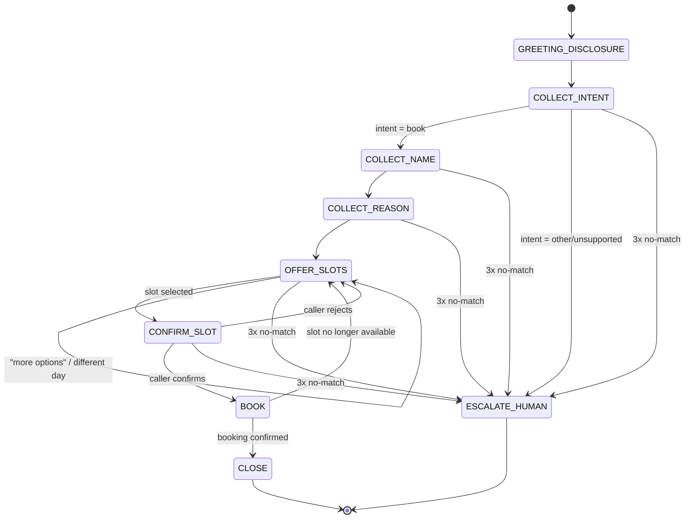

# Build Spec — Dialogue State Machine

This document defines the inbound appointment-scheduling conversation as an explicit finite
state machine: the states, what each collects and validates, how it transitions on success,
and how it handles no-match / invalid input. It is the contract that Phase 3 (dialogue
management) implements and Phase 6 (evals) tests against.

> **Scope note (Phase 0):** this is design only. No pipeline code implements it yet.
> Data examples are synthetic. No real PHI.

## Conventions

- **Global fallback policy:** every collecting state allows up to **2 reprompts** on
  `NO_MATCH` (unintelligible / off-topic / empty input). On the **3rd** failure the state
  routes to `ESCALATE_HUMAN`.
- **Global intents available in any state:** `repeat` (re-read the last prompt),
  `agent`/`human` (→ `ESCALATE_HUMAN`), `cancel`/`goodbye` (→ `CLOSE`).
- **Confirmation style:** slot selection and the final booking are explicitly read back and
  confirmed before any write to the scheduling API.
- **Tool boundary:** `OFFER_SLOTS`, `BOOK`, and hold management map to the three scheduling
  API endpoints (see the mapping table). This is where Phase 2 function-calling wires in.
- **LLM provider:** dialogue/function-calling runs on **Anthropic Claude Haiku 4.5** (swapped
  from Groq-hosted Llama during Phase 3 to unblock eval iteration past Groq's free-tier
  100K-tokens/day cap). Groq remains available as a **dormant** option for future latency
  benchmarking; switching back requires code changes in `agent/src/clinic_agent/pipeline.py`
  and `eval/run_eval.py` (there is no runtime provider flag). See CLAUDE.md for the full note.
  The state machine and tool contract below are provider-agnostic.
- **Telephony layer:** inbound calls arrive over **LiveKit SIP** (free tier, one number
  included: `+14842950169`), wired in Phase 5 (done). The agent still runs on the local
  transport by default (`MODE=local`); `MODE=telephony` switches to the LiveKit SIP path.
  The call-recording consent line (below) is delivered in the greeting on the telephony path.
  Setup is reproducible — see **Phase 5 — Telephony (LiveKit SIP) setup** below.

## State diagram



## States

### GREETING_DISCLOSURE
- **Purpose:** open the call, disclose that the caller is speaking with an AI, and (on
  telephony, Phase 7) state the call-recording consent line.
- **Says (example):** "Thanks for calling Grove Family Clinic. You're speaking with an
  automated AI assistant. I can help you book an appointment. How can I help today?"
- **Collects:** nothing (informational).
- **Validation:** none.
- **Transitions:** → `COLLECT_INTENT` (automatic after the greeting).
- **No-match:** n/a.

### COLLECT_INTENT
- **Purpose:** determine what the caller wants.
- **Collects:** `intent` ∈ {`book_appointment`, `other`}.
- **Validation:** classify caller utterance. Only `book_appointment` is supported this build.
- **Transitions:** `book_appointment` → `COLLECT_NAME`; `other`/unsupported (billing,
  prescriptions, clinical questions) → `ESCALATE_HUMAN`.
- **No-match:** reprompt ("I can help you book an appointment — would you like to schedule
  one?"). After 3 failures → `ESCALATE_HUMAN`.

### COLLECT_NAME
- **Purpose:** capture the patient's name for the booking.
- **Collects:** `patient_name` (string).
- **Validation:** non-empty; at least one alphabetic token. Optionally read back for
  spelling-sensitive names.
- **Transitions:** → `COLLECT_REASON`.
- **No-match:** reprompt ("Sorry, I didn't catch your name — could you say it again?").
  After 3 failures → `ESCALATE_HUMAN`.

### COLLECT_REASON
- **Purpose:** capture the reason for the visit (drives slot filtering / provider matching).
- **Collects:** `reason` (short free text, e.g. "annual checkup", "sore throat").
- **Validation:** non-empty. Map to a coarse visit category if possible; free text is
  acceptable. **Do not** solicit or store detailed clinical/PHI narrative.
- **Transitions:** → `OFFER_SLOTS`.
- **No-match:** reprompt once for clarity; a vague-but-present reason is accepted.
  After 3 failures → `ESCALATE_HUMAN`.

### OFFER_SLOTS
- **Purpose:** fetch and present available appointment slots.
- **Tool call:** `GET /availability` (optionally filtered by reason/provider/date).
- **Collects:** `selected_slot_id` — the caller's choice among the offered slots.
- **Says:** reads back 2–3 options at a time ("I have Tuesday at 9 AM with Dr. Rivera, or
  Wednesday at 2 PM with Dr. Chen — which works?").
- **Validation:** selection must match one of the offered slot IDs.
- **Transitions:** slot selected → `CONFIRM_SLOT`; "more"/"another day"/"different provider"
  → re-query and stay in `OFFER_SLOTS`; no availability at all → `ESCALATE_HUMAN`.
- **No-match:** reprompt with the options again. After 3 failures → `ESCALATE_HUMAN`.

### CONFIRM_SLOT
- **Purpose:** read the chosen slot back and get an explicit yes/no.
- **Tool call:** `POST /hold-slot` (places a short-lived hold on `selected_slot_id`, returns
  `hold_id`) — done on entry so the slot isn't lost while confirming.
- **Collects:** `confirmation` ∈ {yes, no}.
- **Says:** "That's Tuesday, March 4th at 9 AM with Dr. Rivera, for Jane Doe — shall I book
  it?"
- **Validation:** yes/no classification.
- **Transitions:** yes → `BOOK`; no → release hold, → `OFFER_SLOTS`.
- **No-match:** reprompt for a yes/no. After 3 failures → `ESCALATE_HUMAN` (release hold).

### BOOK
- **Purpose:** commit the booking.
- **Tool call:** `POST /confirm-booking` with `hold_id`, `patient_name`, `reason`.
- **Collects:** nothing (action state).
- **Validation:** API returns a `confirmation_id` on success.
- **Transitions:** success → `CLOSE`; hold expired / slot taken (409) → apologize, → `OFFER_SLOTS`;
  unexpected error → `ESCALATE_HUMAN`.
- **No-match:** n/a (no user input expected).

### CLOSE
- **Purpose:** confirm details and end the call politely.
- **Says:** "You're all set — Tuesday, March 4th at 9 AM with Dr. Rivera. Confirmation
  number 12345. Anything else? … Take care."
- **Collects:** nothing.
- **Transitions:** → end. (A follow-up "book another" request may loop back to
  `COLLECT_INTENT`.)

### ESCALATE_HUMAN (global terminal)
- **Purpose:** hand off when the request is unsupported or the caller is stuck.
- **Says:** "Let me get you to a member of our staff — one moment." (Phase 7: warm transfer.)
- **Transitions:** → end (transfer).

## Transition table

| State | Trigger | Next state |
|-------|---------|-----------|
| GREETING_DISCLOSURE | greeting delivered | COLLECT_INTENT |
| COLLECT_INTENT | intent = book_appointment | COLLECT_NAME |
| COLLECT_INTENT | intent = other / unsupported | ESCALATE_HUMAN |
| COLLECT_NAME | valid name | COLLECT_REASON |
| COLLECT_REASON | reason captured | OFFER_SLOTS |
| OFFER_SLOTS | slot selected | CONFIRM_SLOT |
| OFFER_SLOTS | "more" / different day/provider | OFFER_SLOTS (re-query) |
| OFFER_SLOTS | no availability | ESCALATE_HUMAN |
| CONFIRM_SLOT | caller confirms (yes) | BOOK |
| CONFIRM_SLOT | caller rejects (no) | OFFER_SLOTS (release hold) |
| BOOK | booking confirmed | CLOSE |
| BOOK | hold expired / slot taken | OFFER_SLOTS |
| BOOK | unexpected error | ESCALATE_HUMAN |
| *any collecting state* | 3rd consecutive no-match | ESCALATE_HUMAN |
| *any state* | "agent" / "human" | ESCALATE_HUMAN |
| *any state* | "cancel" / "goodbye" | CLOSE |

## State ↔ scheduling API mapping (Phase 2 wiring)

| State | Endpoint | Purpose |
|-------|----------|---------|
| OFFER_SLOTS | `GET /availability` | fetch open slots to offer |
| CONFIRM_SLOT | `POST /hold-slot` | hold the selected slot while confirming |
| CONFIRM_SLOT (reject) | (release hold) | let the hold TTL expire / free the slot |
| BOOK | `POST /confirm-booking` | commit the booking, get confirmation id |

## Data collected across the conversation

| Field | Source state | Notes |
|-------|--------------|-------|
| `intent` | COLLECT_INTENT | only `book_appointment` supported |
| `patient_name` | COLLECT_NAME | synthetic; not real PHI |
| `reason` | COLLECT_REASON | coarse visit reason; no clinical narrative |
| `selected_slot_id` | OFFER_SLOTS | from `GET /availability` |
| `hold_id` | CONFIRM_SLOT | from `POST /hold-slot` |
| `confirmation_id` | BOOK | from `POST /confirm-booking` |

## Governance touchpoints

- **AI disclosure** — mandatory, delivered in `GREETING_DISCLOSURE` on BOTH paths (local +
  telephony). Spoken deterministically (`prompts.AI_DISCLOSURE`), never LLM-generated.
- **Call-recording consent** — delivered in the greeting on the **telephony** path (Phase 5),
  before any booking begins (`prompts.TELEPHONY_GREETING` / `greeting_for("telephony")`). Not
  spoken on the local path, which records nothing.
- **PHI minimization** — `COLLECT_REASON` captures a coarse reason only; the agent never
  solicits detailed medical history. The Phase-2 system prompt also makes it explicit that the
  agent must never read a full name and a phone number back together in one utterance, and must
  not repeat phone numbers / DOB / IDs unless asked. All names/reasons in dev are synthetic.

## Phase-4 target list (known issues to fix during dialogue hardening)

Concrete defects observed in the Phase-3 eval (headless, 16 cases on Claude Haiku 4.5) and in a
manual live voice test. **All five are now fixed (Phase 4 complete) — see the Status column and
the resolution note below.** Each entry records the *exact observed behavior*, where the defect
lives, and how it was found. "Today" in the examples is Monday **2026-07-06** (the eval/live-test
date). Layer column: **LLM** = dialogue / prompt / state logic in the agent; **API** =
scheduling_api backend.

| # | Layer | Defect | Exact observed behavior | Found by | Status (Phase 4) |
|---|-------|--------|-------------------------|----------|------------------|
| 1 | LLM | **Relative-date grounding — wrong calendar date** (off-by-one on weekday references) | Live: caller asked for **"next Sunday"**; agent said **"July 13th"**, but July 13 is a **Monday** — the correct next Sunday is **July 12**. Eval `hp_sorethroat_specificday`: caller asked for **Tuesday** (Jul 7); agent called `check_availability(date='2026-07-08')`, booked Jul 8, and read it back as **"Tuesday, July 8th"** — but Jul 8 is a **Wednesday**. So the model computes the *wrong* calendar date for a relative weekday, and its spoken weekday label disagrees with the date it actually used. Not just mislabeling — the `date=` sent to the tool is wrong. | Live test + eval `hp_sorethroat_specificday` | ✅ **Fixed** — `build_phase2_system_prompt()` injects a 15-day `YYYY-MM-DD = Weekday` reference table so the model looks weekdays up instead of computing them; `hp_sorethroat_specificday` now books Tue Jul 7 with matching weekday label. |
| 2 | API | **Past-time slots offered** — `GET /availability` returns slots whose `start_time` is already in the past | Live: at **~4:25 PM EST (21:25 UTC)**, availability returned a **1:00 PM** slot for the current day — a time that had already passed. The endpoint filters only on `status='available'` (and optional date/reason/provider), never on `start_time >= now`. Fix direction (Phase 4): add a `start_time >= <current UTC>` filter to the availability query so only future slots are returned. This is a `scheduling_api/` change, distinct from the LLM-side defects. | Live test | ✅ **Fixed** — `get_availability` now filters `start_time >= _now()` (`scheduling_api/app/main.py`); regression test `test_availability_excludes_past_slots`. |
| 3 | LLM | **Mid-flow day change never converges to a booking** | Eval `ec_change_day_midflow`: caller booked, then switched day (tomorrow → the day after). Agent correctly re-queried both days (`check_availability(date='2026-07-07')` then `('2026-07-08')`) but then **never offered a concrete time and never called `hold_slot`/`confirm_booking`**; it looped on the clarifying question *"which of the three times would you prefer: 10:30 AM, 1:00 PM, or 2:30 PM on Wednesday, July 8th?"* Outcome: `gracefully_handled`, no booking, when a booking was expected. The caller's "that one's fine" / "yes, book it" had no concrete slot antecedent to bind to. | Eval `ec_change_day_midflow` | ✅ **Fixed** — prompt now offers ≤2 concrete times, binds a generic acceptance to the earliest offered slot, and enforces a single confirmation gate (hold → one read-back → yes → book), eliminating the loop and the extra pre-hold confirm. |
| 4 | LLM | **No empty-window fallback — escalates instead of offering the soonest slot** | Eval `ad_mumbled_vague`: mumbled caller said **"sometime next week"**; agent resolved that to Jul 13–17, queried all five days (all returned **0 slots**, outside the mock's 3-working-day seed window), and escalated (*"Take care!"*) — even though the caller then said **"whatever's open, earliest."** A hardened agent should, on an empty preferred window plus an "earliest is fine" signal, drop the window constraint and offer the soonest available slot before escalating. (Partly a test-design artifact: "next week" is genuinely outside the seed window — but the failure to fall back on "earliest" is a real dialogue gap.) | Eval `ad_mumbled_vague` | ✅ **Fixed** — on a zero-slot window the prompt now re-calls `check_availability` with no date filter for the soonest slot before escalating; `ad_mumbled_vague` now books. |
| 5 | LLM | **Past-time slot read-back** (defense-in-depth, linked to #1/#2) | Agent could read back a confirmed time already passed today. Backstopped by the #2 API filter; wanted a prompt-level guard too. | Live test | ✅ **Fixed** — prompt reads back full date + day-of-week + time and only offers/confirms future times (`{now_utc}` injected); backed by the #2 API filter. |

**Bonus bug found while fixing #3/#4 — fabricated booking:** on one eval run the agent read the
internal `hold_id` back as a "confirmation number" and said "you're all set" *without ever calling
`confirm_booking`* — a caller would believe in an appointment that never existed. Fixed with a
prompt invariant: no "you're all set" / confirmation number until `confirm_booking` returns one;
`hold_id` is never spoken.

**Eval result:** Phase-3 baseline **88% task completion / 81% overall pass** → Phase-4 **100% /
100%** (16/16), slot-filling 8/9 → 11/11. The two fragile edge cases (`ec_change_day_midflow`,
`ad_mumbled_vague`) were confirmed stable across 3 isolated runs each (temperature=0 is not fully
deterministic with tool use).

**Not defects (scored PASS, noted for clarity):** `ad_unsupported_intent` and `ad_wants_human`
correctly declined to book an out-of-scope / human-handoff request. Structural scoring can't
distinguish "escalated" from "declined-to-book" (both = no booking), so their display shows
`exp=escalated got=gracefully_handled` on a PASS; the traces confirm proper hand-off language.

## Phase 5 — Telephony (LiveKit SIP) setup

Inbound calls to `+14842950169` reach the same Pipecat pipeline as local dev; only the
transport changes. There is **one runtime switch** (`MODE`) and **one-time LiveKit
provisioning** (an idempotent script). Nothing about the ASR→LLM→TTS loop, tool calls, mic
gate, or barge-in differs between modes.

### How it fits together

```
caller phone ──PSTN──▶ LiveKit SIP (number +14842950169)
                          │  inbound trunk  (binds the number to our LiveKit project)
                          │  dispatch rule  (Direct → room "clinic-inbound")
                          ▼
                   LiveKit room "clinic-inbound" ◀── agent process (MODE=telephony)
                                                       joins the same room, waits for the
                                                       caller, then runs the booking flow
```

- **Direct dispatch** routes every inbound call into the single fixed room `clinic-inbound`
  (`config.TELEPHONY_ROOM_NAME`). The agent joins that same room and greets on
  `on_first_participant_joined` — i.e. when the caller actually connects, not at process
  start (the room exists but is empty before the call lands). Fine for a single demo call.
- **Concurrency (Phase 6):** Direct = one shared room, so it does **not** support simultaneous
  calls. Multi-call requires an **Individual** dispatch rule (room-per-call) + LiveKit agent
  dispatch starting one agent process per room — the "one container per session" model Phase 6
  Dockerizes. The setup script documents this in a comment.

### Required `.env` (agent/.env, git-ignored)

```
LIVEKIT_URL=wss://<your-project>.livekit.cloud
LIVEKIT_API_KEY=<key>
LIVEKIT_API_SECRET=<secret>
LIVEKIT_PHONE_NUMBER=+14842950169
```

### Steps (reproducible)

1. **Provision the SIP trunk + dispatch rule (one-time, idempotent):**
   ```bash
   cd agent && uv run python scripts/setup_livekit_sip.py
   ```
   The script prints `FOUND` vs `CREATED` per resource, so a re-run shows current state
   without changing anything. It never deletes or mutates existing resources.

2. **Start the agent in telephony mode** (in a separate terminal; the mock scheduling API must
   also be running per the root README):
   ```bash
   cd agent && MODE=telephony uv run python -m clinic_agent.pipeline
   ```
   It joins room `clinic-inbound` and logs that it is waiting for the inbound SIP caller.

3. **Call `+14842950169`.** The agent greets with the AI disclosure + call-recording consent,
   then runs the normal booking flow.

Local dev is unchanged: omit `MODE` (defaults to `local`) to use the laptop mic/speaker.

### Known limitations / Phase 6 follow-ups

- **Seed slot hours are stored as UTC**, not clinic-local. `scheduling_api/app/seed_data.py`
  generates slots at `09:00, 10:30, 13:00, 14:30` **UTC** (`tzinfo=timezone.utc`). The Phase-5
  timezone fix made the agent's *current-time* reasoning clinic-local (`America/New_York`), but
  the stored slot **hours** are still UTC while the availability filter compares on the UTC
  instant. At early-morning hours this is invisible (every slot is future in both frames), but a
  **mid-day caller may see a slot filtered out that still appears upcoming in Eastern time**
  (e.g. a 09:00 UTC slot = 5 AM EDT is dropped once 09:00 UTC passes, even though the agent
  speaks it as an early-morning local time). **Fix:** localize the seed to `America/New_York`
  when storing (`datetime.combine(day, t, tzinfo=CLINIC_TZ)`) so slot hours are true clinic-local
  times. **Deferred to Phase 6.**
- **1–2 seconds of audio noise at the very start of a telephony call is normal** SIP/RTP
  media negotiation (codec/jitter-buffer settling), **not a code issue** — no fix needed.
- **Reschedules are handled as brand-new bookings** — the mock API has no patient-lookup
  endpoint, so a returning caller re-collects intake and books a fresh slot rather than amending
  an existing appointment. **Deferred:** add a patient/appointment lookup endpoint if reschedule
  flows are needed.
