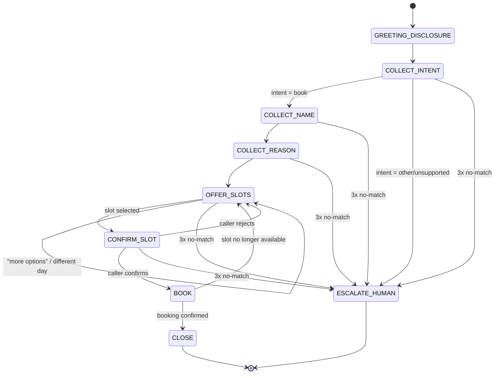

# Build Spec — Dialogue State Machine

This document defines the inbound appointment-scheduling conversation as an explicit finite
state machine: the states, what each collects and validates, how it transitions on success,
and how it handles no-match / invalid input. It is the contract that Phase 3 (dialogue
management) implements and Phase 6 (evals) tests against.

> **Scope note (Phase 0):** this is design only. No pipeline code implements it yet.
> Data examples are synthetic. No real PHI.

## Conventions

- **Global fallback policy:** every collecting state allows up to **2 reprompts** on
  `NO_MATCH` (unintelligible / off-topic / empty input). On the **3rd** failure the state
  routes to `ESCALATE_HUMAN`.
- **Global intents available in any state:** `repeat` (re-read the last prompt),
  `agent`/`human` (→ `ESCALATE_HUMAN`), `cancel`/`goodbye` (→ `CLOSE`).
- **Confirmation style:** slot selection and the final booking are explicitly read back and
  confirmed before any write to the scheduling API.
- **Tool boundary:** `OFFER_SLOTS`, `BOOK`, and hold management map to the three scheduling
  API endpoints (see the mapping table). This is where Phase 2 function-calling wires in.
- **LLM provider:** dialogue/function-calling runs on **Anthropic Claude Haiku 4.5** (swapped
  from Groq-hosted Llama during Phase 3 to unblock eval iteration past Groq's free-tier
  100K-tokens/day cap). Groq remains available as a **dormant** option for future latency
  benchmarking; switching back requires code changes in `agent/src/clinic_agent/pipeline.py`
  and `eval/run_eval.py` (there is no runtime provider flag). See CLAUDE.md for the full note.
  The state machine and tool contract below are provider-agnostic.

## State diagram

## States

### GREETING_DISCLOSURE
- **Purpose:** open the call, disclose that the caller is speaking with an AI, and (on
  telephony, Phase 7) state the call-recording consent line.
- **Says (example):** "Thanks for calling Grove Family Clinic. You're speaking with an
  automated AI assistant. I can help you book an appointment. How can I help today?"
- **Collects:** nothing (informational).
- **Validation:** none.
- **Transitions:** → `COLLECT_INTENT` (automatic after the greeting).
- **No-match:** n/a.

### COLLECT_INTENT
- **Purpose:** determine what the caller wants.
- **Collects:** `intent` ∈ {`book_appointment`, `other`}.
- **Validation:** classify caller utterance. Only `book_appointment` is supported this build.
- **Transitions:** `book_appointment` → `COLLECT_NAME`; `other`/unsupported (billing,
  prescriptions, clinical questions) → `ESCALATE_HUMAN`.
- **No-match:** reprompt ("I can help you book an appointment — would you like to schedule
  one?"). After 3 failures → `ESCALATE_HUMAN`.

### COLLECT_NAME
- **Purpose:** capture the patient's name for the booking.
- **Collects:** `patient_name` (string).
- **Validation:** non-empty; at least one alphabetic token. Optionally read back for
  spelling-sensitive names.
- **Transitions:** → `COLLECT_REASON`.
- **No-match:** reprompt ("Sorry, I didn't catch your name — could you say it again?").
  After 3 failures → `ESCALATE_HUMAN`.

### COLLECT_REASON
- **Purpose:** capture the reason for the visit (drives slot filtering / provider matching).
- **Collects:** `reason` (short free text, e.g. "annual checkup", "sore throat").
- **Validation:** non-empty. Map to a coarse visit category if possible; free text is
  acceptable. **Do not** solicit or store detailed clinical/PHI narrative.
- **Transitions:** → `OFFER_SLOTS`.
- **No-match:** reprompt once for clarity; a vague-but-present reason is accepted.
  After 3 failures → `ESCALATE_HUMAN`.

### OFFER_SLOTS
- **Purpose:** fetch and present available appointment slots.
- **Tool call:** `GET /availability` (optionally filtered by reason/provider/date).
- **Collects:** `selected_slot_id` — the caller's choice among the offered slots.
- **Says:** reads back 2–3 options at a time ("I have Tuesday at 9 AM with Dr. Rivera, or
  Wednesday at 2 PM with Dr. Chen — which works?").
- **Validation:** selection must match one of the offered slot IDs.
- **Transitions:** slot selected → `CONFIRM_SLOT`; "more"/"another day"/"different provider"
  → re-query and stay in `OFFER_SLOTS`; no availability at all → `ESCALATE_HUMAN`.
- **No-match:** reprompt with the options again. After 3 failures → `ESCALATE_HUMAN`.

### CONFIRM_SLOT
- **Purpose:** read the chosen slot back and get an explicit yes/no.
- **Tool call:** `POST /hold-slot` (places a short-lived hold on `selected_slot_id`, returns
  `hold_id`) — done on entry so the slot isn't lost while confirming.
- **Collects:** `confirmation` ∈ {yes, no}.
- **Says:** "That's Tuesday, March 4th at 9 AM with Dr. Rivera, for Jane Doe — shall I book
  it?"
- **Validation:** yes/no classification.
- **Transitions:** yes → `BOOK`; no → release hold, → `OFFER_SLOTS`.
- **No-match:** reprompt for a yes/no. After 3 failures → `ESCALATE_HUMAN` (release hold).

### BOOK
- **Purpose:** commit the booking.
- **Tool call:** `POST /confirm-booking` with `hold_id`, `patient_name`, `reason`.
- **Collects:** nothing (action state).
- **Validation:** API returns a `confirmation_id` on success.
- **Transitions:** success → `CLOSE`; hold expired / slot taken (409) → apologize, → `OFFER_SLOTS`;
  unexpected error → `ESCALATE_HUMAN`.
- **No-match:** n/a (no user input expected).

### CLOSE
- **Purpose:** confirm details and end the call politely.
- **Says:** "You're all set — Tuesday, March 4th at 9 AM with Dr. Rivera. Confirmation
  number 12345. Anything else? … Take care."
- **Collects:** nothing.
- **Transitions:** → end. (A follow-up "book another" request may loop back to
  `COLLECT_INTENT`.)

### ESCALATE_HUMAN (global terminal)
- **Purpose:** hand off when the request is unsupported or the caller is stuck.
- **Says:** "Let me get you to a member of our staff — one moment." (Phase 7: warm transfer.)
- **Transitions:** → end (transfer).

## Transition table

| State | Trigger | Next state |
|-------|---------|-----------|
| GREETING_DISCLOSURE | greeting delivered | COLLECT_INTENT |
| COLLECT_INTENT | intent = book_appointment | COLLECT_NAME |
| COLLECT_INTENT | intent = other / unsupported | ESCALATE_HUMAN |
| COLLECT_NAME | valid name | COLLECT_REASON |
| COLLECT_REASON | reason captured | OFFER_SLOTS |
| OFFER_SLOTS | slot selected | CONFIRM_SLOT |
| OFFER_SLOTS | "more" / different day/provider | OFFER_SLOTS (re-query) |
| OFFER_SLOTS | no availability | ESCALATE_HUMAN |
| CONFIRM_SLOT | caller confirms (yes) | BOOK |
| CONFIRM_SLOT | caller rejects (no) | OFFER_SLOTS (release hold) |
| BOOK | booking confirmed | CLOSE |
| BOOK | hold expired / slot taken | OFFER_SLOTS |
| BOOK | unexpected error | ESCALATE_HUMAN |
| *any collecting state* | 3rd consecutive no-match | ESCALATE_HUMAN |
| *any state* | "agent" / "human" | ESCALATE_HUMAN |
| *any state* | "cancel" / "goodbye" | CLOSE |

## State ↔ scheduling API mapping (Phase 2 wiring)

| State | Endpoint | Purpose |
|-------|----------|---------|
| OFFER_SLOTS | `GET /availability` | fetch open slots to offer |
| CONFIRM_SLOT | `POST /hold-slot` | hold the selected slot while confirming |
| CONFIRM_SLOT (reject) | (release hold) | let the hold TTL expire / free the slot |
| BOOK | `POST /confirm-booking` | commit the booking, get confirmation id |

## Data collected across the conversation

| Field | Source state | Notes |
|-------|--------------|-------|
| `intent` | COLLECT_INTENT | only `book_appointment` supported |
| `patient_name` | COLLECT_NAME | synthetic; not real PHI |
| `reason` | COLLECT_REASON | coarse visit reason; no clinical narrative |
| `selected_slot_id` | OFFER_SLOTS | from `GET /availability` |
| `hold_id` | CONFIRM_SLOT | from `POST /hold-slot` |
| `confirmation_id` | BOOK | from `POST /confirm-booking` |

## Governance touchpoints

- **AI disclosure** — mandatory, delivered in `GREETING_DISCLOSURE`.
- **Call-recording consent** — added to `GREETING_DISCLOSURE` when telephony lands (Phase 7).
- **PHI minimization** — `COLLECT_REASON` captures a coarse reason only; the agent never
  solicits detailed medical history. All names/reasons in dev are synthetic.
