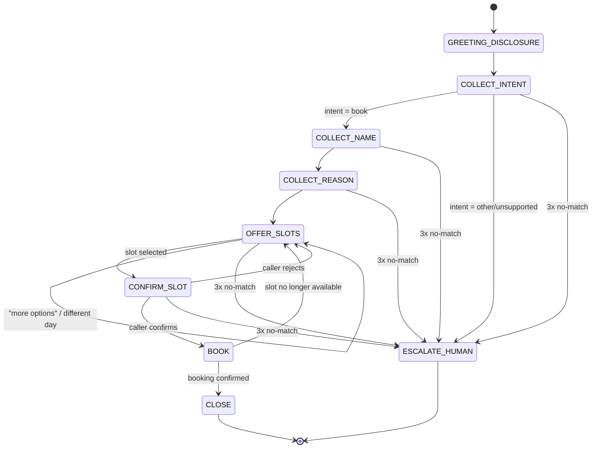

# Build Spec — Dialogue State Machine

This document defines the inbound appointment-scheduling conversation as an explicit finite
state machine: the states, what each collects and validates, how it transitions on success,
and how it handles no-match / invalid input. It is the contract that Phase 3 (dialogue
management) implements and Phase 6 (evals) tests against.

> **Scope note (Phase 0):** this is design only. No pipeline code implements it yet.
> Data examples are synthetic. No real PHI.

## Conventions

- **Global fallback policy:** every collecting state allows up to **2 reprompts** on
  `NO_MATCH` (unintelligible / off-topic / empty input). On the **3rd** failure the state
  routes to `ESCALATE_HUMAN`.
- **Global intents available in any state:** `repeat` (re-read the last prompt),
  `agent`/`human` (→ `ESCALATE_HUMAN`), `cancel`/`goodbye` (→ `CLOSE`).
- **Confirmation style:** slot selection and the final booking are explicitly read back and
  confirmed before any write to the scheduling API.
- **Tool boundary:** `OFFER_SLOTS`, `BOOK`, and hold management map to the three scheduling
  API endpoints (see the mapping table). This is where Phase 2 function-calling wires in.
- **LLM provider:** dialogue/function-calling runs on **Anthropic Claude Haiku 4.5** (swapped
  from Groq-hosted Llama during Phase 3 to unblock eval iteration past Groq's free-tier
  100K-tokens/day cap). Groq remains available as a **dormant** option for future latency
  benchmarking; switching back requires code changes in `agent/src/clinic_agent/pipeline.py`
  and `eval/run_eval.py` (there is no runtime provider flag). See CLAUDE.md for the full note.
  The state machine and tool contract below are provider-agnostic.
- **Telephony layer:** inbound calls arrive over **LiveKit SIP** (free tier, one number
  included: `+14842950169`), wired in Phase 5 (done). The agent still runs on the local
  transport by default (`MODE=local`); `MODE=telephony` switches to the LiveKit SIP path.
  The call-recording consent line (below) is delivered in the greeting on the telephony path.
  Setup is reproducible — see **Phase 5 — Telephony (LiveKit SIP) setup** below.

## State diagram



## States

### GREETING_DISCLOSURE
- **Purpose:** open the call, disclose that the caller is speaking with an AI, and (on
  telephony, Phase 7) state the call-recording consent line.
- **Says (example):** "Thanks for calling Grove Family Clinic. You're speaking with an
  automated AI assistant. I can help you book an appointment. How can I help today?"
- **Collects:** nothing (informational).
- **Validation:** none.
- **Transitions:** → `COLLECT_INTENT` (automatic after the greeting).
- **No-match:** n/a.

### COLLECT_INTENT
- **Purpose:** determine what the caller wants.
- **Collects:** `intent` ∈ {`book_appointment`, `other`}.
- **Validation:** classify caller utterance. Only `book_appointment` is supported this build.
- **Transitions:** `book_appointment` → `COLLECT_NAME`; `other`/unsupported (billing,
  prescriptions, clinical questions) → `ESCALATE_HUMAN`.
- **No-match:** reprompt ("I can help you book an appointment — would you like to schedule
  one?"). After 3 failures → `ESCALATE_HUMAN`.

### COLLECT_NAME
- **Purpose:** capture the patient's name for the booking.
- **Collects:** `patient_name` (string).
- **Validation:** non-empty; at least one alphabetic token. Optionally read back for
  spelling-sensitive names.
- **Transitions:** → `COLLECT_REASON`.
- **No-match:** reprompt ("Sorry, I didn't catch your name — could you say it again?").
  After 3 failures → `ESCALATE_HUMAN`.

### COLLECT_REASON
- **Purpose:** capture the reason for the visit (drives slot filtering / provider matching).
- **Collects:** `reason` (short free text, e.g. "annual checkup", "sore throat").
- **Validation:** non-empty. Map to a coarse visit category if possible; free text is
  acceptable. **Do not** solicit or store detailed clinical/PHI narrative.
- **Transitions:** → `OFFER_SLOTS`.
- **No-match:** reprompt once for clarity; a vague-but-present reason is accepted.
  After 3 failures → `ESCALATE_HUMAN`.

### OFFER_SLOTS
- **Purpose:** fetch and present available appointment slots.
- **Tool call:** `GET /availability` (optionally filtered by reason/provider/date).
- **Collects:** `selected_slot_id` — the caller's choice among the offered slots.
- **Says:** reads back 2–3 options at a time ("I have Tuesday at 9 AM with Dr. Rivera, or
  Wednesday at 2 PM with Dr. Chen — which works?").
- **Validation:** selection must match one of the offered slot IDs.
- **Transitions:** slot selected → `CONFIRM_SLOT`; "more"/"another day"/"different provider"
  → re-query and stay in `OFFER_SLOTS`; no availability at all → `ESCALATE_HUMAN`.
- **No-match:** reprompt with the options again. After 3 failures → `ESCALATE_HUMAN`.

### CONFIRM_SLOT
- **Purpose:** read the chosen slot back and get an explicit yes/no.
- **Tool call:** `POST /hold-slot` (places a short-lived hold on `selected_slot_id`, returns
  `hold_id`) — done on entry so the slot isn't lost while confirming.
- **Collects:** `confirmation` ∈ {yes, no}.
- **Says:** "That's Tuesday, March 4th at 9 AM with Dr. Rivera, for Jane Doe — shall I book
  it?"
- **Validation:** yes/no classification.
- **Transitions:** yes → `BOOK`; no → release hold, → `OFFER_SLOTS`.
- **No-match:** reprompt for a yes/no. After 3 failures → `ESCALATE_HUMAN` (release hold).

### BOOK
- **Purpose:** commit the booking.
- **Tool call:** `POST /confirm-booking` with `hold_id`, `patient_name`, `reason`.
- **Collects:** nothing (action state).
- **Validation:** API returns a `confirmation_id` on success.
- **Transitions:** success → `CLOSE`; hold expired / slot taken (409) → apologize, → `OFFER_SLOTS`;
  unexpected error → `ESCALATE_HUMAN`.
- **No-match:** n/a (no user input expected).

### CLOSE
- **Purpose:** confirm details and end the call politely.
- **Says:** "You're all set — Tuesday, March 4th at 9 AM with Dr. Rivera. Confirmation
  number 12345. Anything else? … Take care."
- **Collects:** nothing.
- **Transitions:** → end. (A follow-up "book another" request may loop back to
  `COLLECT_INTENT`.)

### ESCALATE_HUMAN (global terminal)
- **Purpose:** hand off when the request is unsupported or the caller is stuck.
- **Says:** "Let me get you to a member of our staff — one moment." (Phase 7: warm transfer.)
- **Transitions:** → end (transfer).

## Transition table

| State | Trigger | Next state |
|-------|---------|-----------|
| GREETING_DISCLOSURE | greeting delivered | COLLECT_INTENT |
| COLLECT_INTENT | intent = book_appointment | COLLECT_NAME |
| COLLECT_INTENT | intent = other / unsupported | ESCALATE_HUMAN |
| COLLECT_NAME | valid name | COLLECT_REASON |
| COLLECT_REASON | reason captured | OFFER_SLOTS |
| OFFER_SLOTS | slot selected | CONFIRM_SLOT |
| OFFER_SLOTS | "more" / different day/provider | OFFER_SLOTS (re-query) |
| OFFER_SLOTS | no availability | ESCALATE_HUMAN |
| CONFIRM_SLOT | caller confirms (yes) | BOOK |
| CONFIRM_SLOT | caller rejects (no) | OFFER_SLOTS (release hold) |
| BOOK | booking confirmed | CLOSE |
| BOOK | hold expired / slot taken | OFFER_SLOTS |
| BOOK | unexpected error | ESCALATE_HUMAN |
| *any collecting state* | 3rd consecutive no-match | ESCALATE_HUMAN |
| *any state* | "agent" / "human" | ESCALATE_HUMAN |
| *any state* | "cancel" / "goodbye" | CLOSE |

## State ↔ scheduling API mapping (Phase 2 wiring)

| State | Endpoint | Purpose |
|-------|----------|---------|
| OFFER_SLOTS | `GET /availability` | fetch open slots to offer |
| CONFIRM_SLOT | `POST /hold-slot` | hold the selected slot while confirming |
| CONFIRM_SLOT (reject) | (release hold) | let the hold TTL expire / free the slot |
| BOOK | `POST /confirm-booking` | commit the booking, get confirmation id |

## Data collected across the conversation

| Field | Source state | Notes |
|-------|--------------|-------|
| `intent` | COLLECT_INTENT | only `book_appointment` supported |
| `patient_name` | COLLECT_NAME | synthetic; not real PHI |
| `reason` | COLLECT_REASON | coarse visit reason; no clinical narrative |
| `selected_slot_id` | OFFER_SLOTS | from `GET /availability` |
| `hold_id` | CONFIRM_SLOT | from `POST /hold-slot` |
| `confirmation_id` | BOOK | from `POST /confirm-booking` |

## Governance touchpoints

- **AI disclosure** — mandatory, delivered in `GREETING_DISCLOSURE` on BOTH paths (local +
  telephony). Spoken deterministically (`prompts.AI_DISCLOSURE`), never LLM-generated.
- **Call-recording consent** — delivered in the greeting on the **telephony** path (Phase 5),
  before any booking begins (`prompts.TELEPHONY_GREETING` / `greeting_for("telephony")`). Not
  spoken on the local path, which records nothing.
- **PHI minimization** — `COLLECT_REASON` captures a coarse reason only; the agent never
  solicits detailed medical history. The Phase-2 system prompt also makes it explicit that the
  agent must never read a full name and a phone number back together in one utterance, and must
  not repeat phone numbers / DOB / IDs unless asked. All names/reasons in dev are synthetic.

## Phase-4 target list (known issues to fix during dialogue hardening)

Concrete defects observed in the Phase-3 eval (headless, 16 cases on Claude Haiku 4.5) and in a
manual live voice test. **All five are now fixed (Phase 4 complete) — see the Status column and
the resolution note below.** Each entry records the *exact observed behavior*, where the defect
lives, and how it was found. "Today" in the examples is Monday **2026-07-06** (the eval/live-test
date). Layer column: **LLM** = dialogue / prompt / state logic in the agent; **API** =
scheduling_api backend.

| # | Layer | Defect | Exact observed behavior | Found by | Status (Phase 4) |
|---|-------|--------|-------------------------|----------|------------------|
| 1 | LLM | **Relative-date grounding — wrong calendar date** (off-by-one on weekday references) | Live: caller asked for **"next Sunday"**; agent said **"July 13th"**, but July 13 is a **Monday** — the correct next Sunday is **July 12**. Eval `hp_sorethroat_specificday`: caller asked for **Tuesday** (Jul 7); agent called `check_availability(date='2026-07-08')`, booked Jul 8, and read it back as **"Tuesday, July 8th"** — but Jul 8 is a **Wednesday**. So the model computes the *wrong* calendar date for a relative weekday, and its spoken weekday label disagrees with the date it actually used. Not just mislabeling — the `date=` sent to the tool is wrong. | Live test + eval `hp_sorethroat_specificday` | ✅ **Fixed** — `build_phase2_system_prompt()` injects a 15-day `YYYY-MM-DD = Weekday` reference table so the model looks weekdays up instead of computing them; `hp_sorethroat_specificday` now books Tue Jul 7 with matching weekday label. |
| 2 | API | **Past-time slots offered** — `GET /availability` returns slots whose `start_time` is already in the past | Live: at **~4:25 PM EST (21:25 UTC)**, availability returned a **1:00 PM** slot for the current day — a time that had already passed. The endpoint filters only on `status='available'` (and optional date/reason/provider), never on `start_time >= now`. Fix direction (Phase 4): add a `start_time >= <current UTC>` filter to the availability query so only future slots are returned. This is a `scheduling_api/` change, distinct from the LLM-side defects. | Live test | ✅ **Fixed** — `get_availability` now filters `start_time >= _now()` (`scheduling_api/app/main.py`); regression test `test_availability_excludes_past_slots`. |
| 3 | LLM | **Mid-flow day change never converges to a booking** | Eval `ec_change_day_midflow`: caller booked, then switched day (tomorrow → the day after). Agent correctly re-queried both days (`check_availability(date='2026-07-07')` then `('2026-07-08')`) but then **never offered a concrete time and never called `hold_slot`/`confirm_booking`**; it looped on the clarifying question *"which of the three times would you prefer: 10:30 AM, 1:00 PM, or 2:30 PM on Wednesday, July 8th?"* Outcome: `gracefully_handled`, no booking, when a booking was expected. The caller's "that one's fine" / "yes, book it" had no concrete slot antecedent to bind to. | Eval `ec_change_day_midflow` | ✅ **Fixed** — prompt now offers ≤2 concrete times, binds a generic acceptance to the earliest offered slot, and enforces a single confirmation gate (hold → one read-back → yes → book), eliminating the loop and the extra pre-hold confirm. |
| 4 | LLM | **No empty-window fallback — escalates instead of offering the soonest slot** | Eval `ad_mumbled_vague`: mumbled caller said **"sometime next week"**; agent resolved that to Jul 13–17, queried all five days (all returned **0 slots**, outside the mock's 3-working-day seed window), and escalated (*"Take care!"*) — even though the caller then said **"whatever's open, earliest."** A hardened agent should, on an empty preferred window plus an "earliest is fine" signal, drop the window constraint and offer the soonest available slot before escalating. (Partly a test-design artifact: "next week" is genuinely outside the seed window — but the failure to fall back on "earliest" is a real dialogue gap.) | Eval `ad_mumbled_vague` | ✅ **Fixed** — on a zero-slot window the prompt now re-calls `check_availability` with no date filter for the soonest slot before escalating; `ad_mumbled_vague` now books. |
| 5 | LLM | **Past-time slot read-back** (defense-in-depth, linked to #1/#2) | Agent could read back a confirmed time already passed today. Backstopped by the #2 API filter; wanted a prompt-level guard too. | Live test | ✅ **Fixed** — prompt reads back full date + day-of-week + time and only offers/confirms future times (`{now_utc}` injected); backed by the #2 API filter. |

**Bonus bug found while fixing #3/#4 — fabricated booking:** on one eval run the agent read the
internal `hold_id` back as a "confirmation number" and said "you're all set" *without ever calling
`confirm_booking`* — a caller would believe in an appointment that never existed. Fixed with a
prompt invariant: no "you're all set" / confirmation number until `confirm_booking` returns one;
`hold_id` is never spoken.

**Eval result:** Phase-3 baseline **88% task completion / 81% overall pass** → Phase-4 **100% /
100%** (16/16), slot-filling 8/9 → 11/11. The two fragile edge cases (`ec_change_day_midflow`,
`ad_mumbled_vague`) were confirmed stable across 3 isolated runs each (temperature=0 is not fully
deterministic with tool use).

**Not defects (scored PASS, noted for clarity):** `ad_unsupported_intent` and `ad_wants_human`
correctly declined to book an out-of-scope / human-handoff request. Structural scoring can't
distinguish "escalated" from "declined-to-book" (both = no booking), so their display shows
`exp=escalated got=gracefully_handled` on a PASS; the traces confirm proper hand-off language.

## Phase 5 — Telephony (LiveKit SIP) setup

Inbound calls to `+14842950169` reach the same Pipecat pipeline as local dev; only the
transport changes. There is **one runtime switch** (`MODE`) and **one-time LiveKit
provisioning** (an idempotent script). Nothing about the ASR→LLM→TTS loop, tool calls, mic
gate, or barge-in differs between modes.

### How it fits together

```
caller phone ──PSTN──▶ LiveKit SIP (number +14842950169)
                          │  inbound trunk  (binds the number to our LiveKit project)
                          │  dispatch rule  (Direct → room "clinic-inbound")
                          ▼
                   LiveKit room "clinic-inbound" ◀── agent process (MODE=telephony)
                                                       joins the same room, waits for the
                                                       caller, then runs the booking flow
```

- **Direct dispatch** routes every inbound call into the single fixed room `clinic-inbound`
  (`config.TELEPHONY_ROOM_NAME`). The agent joins that same room and greets on
  `on_first_participant_joined` — i.e. when the caller actually connects, not at process
  start (the room exists but is empty before the call lands). Fine for a single demo call.
- **Concurrency (Phase 6):** Direct = one shared room, so it does **not** support simultaneous
  calls. Multi-call requires an **Individual** dispatch rule (room-per-call) + LiveKit agent
  dispatch starting one agent process per room — the "one container per session" model Phase 6
  Dockerizes. The setup script documents this in a comment.

### Required `.env` (agent/.env, git-ignored)

```
LIVEKIT_URL=wss://<your-project>.livekit.cloud
LIVEKIT_API_KEY=<key>
LIVEKIT_API_SECRET=<secret>
LIVEKIT_PHONE_NUMBER=+14842950169
```

### Steps (reproducible)

1. **Provision the SIP trunk + dispatch rule (one-time, idempotent):**
   ```bash
   cd agent && uv run python scripts/setup_livekit_sip.py
   ```
   The script prints `FOUND` vs `CREATED` per resource, so a re-run shows current state
   without changing anything. It never deletes or mutates existing resources.

2. **Start the agent in telephony mode** (in a separate terminal; the mock scheduling API must
   also be running per the root README):
   ```bash
   cd agent && MODE=telephony uv run python -m clinic_agent.pipeline
   ```
   It joins room `clinic-inbound` and logs that it is waiting for the inbound SIP caller.

3. **Call `+14842950169`.** The agent greets with the AI disclosure + call-recording consent,
   then runs the normal booking flow.

Local dev is unchanged: omit `MODE` (defaults to `local`) to use the laptop mic/speaker.

### Known limitations / Phase 6 follow-ups

- **Seed slot hours are stored as UTC**, not clinic-local. `scheduling_api/app/seed_data.py`
  generates slots at `09:00, 10:30, 13:00, 14:30` **UTC** (`tzinfo=timezone.utc`). The Phase-5
  timezone fix made the agent's *current-time* reasoning clinic-local (`America/New_York`), but
  the stored slot **hours** are still UTC while the availability filter compares on the UTC
  instant. At early-morning hours this is invisible (every slot is future in both frames), but a
  **mid-day caller may see a slot filtered out that still appears upcoming in Eastern time**
  (e.g. a 09:00 UTC slot = 5 AM EDT is dropped once 09:00 UTC passes, even though the agent
  speaks it as an early-morning local time). **Fix:** localize the seed to `America/New_York`
  when storing (`datetime.combine(day, t, tzinfo=CLINIC_TZ)`) so slot hours are true clinic-local
  times. **Deferred to Phase 6.**
- **1–2 seconds of audio noise at the very start of a telephony call is normal** SIP/RTP
  media negotiation (codec/jitter-buffer settling), **not a code issue** — no fix needed.
- **Reschedules are handled as brand-new bookings** — the mock API has no patient-lookup
  endpoint, so a returning caller re-collects intake and books a fresh slot rather than amending
  an existing appointment. **Deferred:** add a patient/appointment lookup endpoint if reschedule
  flows are needed.

## Phase 6 — Observability, Docker, and the ngrok demo

Phase 6 makes the running agent measurable and packageable: structured per-turn latency logging,
a live dashboard, container images, and a one-command demo launcher. No cloud deployment — the
demo runs the agent locally (it reaches LiveKit Cloud outbound) and uses **ngrok** only to expose
the dashboard/API publicly.

### Observability — per-turn latency + call outcomes

The agent writes newline-delimited JSON to **`logs/calls.jsonl`** (one object per event), *alongside*
the existing human-readable console logs (`ASR ▶ / LLM ▶ / TOOL ▶ / TTS ▶`) — the JSON is an added
sink, not a replacement. Instrumentation lives in `agent/src/clinic_agent/metrics.py`
(`LatencyCollector` + three `MetricsTap` pass-through processors inserted after STT, LLM, and TTS);
the taps never mutate or drop a frame.

A **turn** spans the caller's VAD silence to the first audio frame of the bot's reply. Four
latencies are captured per turn from the Pipecat frame stream:

| Metric | Boundary (frame → frame) |
|--------|--------------------------|
| `asr_ms` | `VADUserStoppedSpeakingFrame` → final `TranscriptionFrame` |
| `llm_ms` | final `TranscriptionFrame` → first `LLMTextFrame` **or** first `FunctionCallInProgressFrame` |
| `tts_ms` | last `LLMFullResponseEndFrame` → first `OutputAudioRawFrame` |
| `e2e_ms` | `VADUserStoppedSpeakingFrame` → first `OutputAudioRawFrame` (voice-to-voice) |

> The VAD-silence boundary is Pipecat's `VADUserStoppedSpeakingFrame` (emitted by the in-pipeline
> `VADProcessor`), *not* the higher-level `UserStoppedSpeakingFrame` — a distinction that matters:
> using the wrong class silently records zero turns.

Deltas use `time.monotonic()`. Each turn record also carries **ASR confidence** (Deepgram's
`result.channel.alternatives[0].confidence`, or `null` if not surfaced — a one-time session warning
fires if it's never present) and `had_tool_call`. Each scheduling-tool call emits a `tool` event
(`endpoint`, `http_status`, `latency_ms`, `success`). At hangup a `call_summary` event records the
**outcome** and **P50/P95/P99** for all four stages, and the agent also prints a human-readable
console line, e.g.:

```
[session] outcome=booked turns=6 | ASR p50=210ms p95=340ms | LLM p50=480ms p95=720ms | TTS p50=320ms p95=450ms | E2E p50=1010ms p95=1340ms
```

Two honesty caveats (surfaced in the dashboard footnotes too):

- **Outcome is heuristic-based:** `booked` = a `confirm_booking` succeeded; `escalated` = availability
  came back empty and the agent handed off; `abandoned` = the call ended with neither. It approximates
  intent; it doesn't read it.
- **`llm_ms` on tool-call turns ends at the *first tool call*,** not the final spoken response, so those
  turns show a lower LLM figure than the caller feels. **`e2e_ms` is the honest number on tool-call turns.**

`logs/calls.jsonl` is a runtime artifact (git-ignored), and `logs/` is shared between the agent
(writer) and the API (reader) via the repo-root `logs/` dir — overridable with `CLINIC_LOG_DIR`
(set to a shared volume under Docker).

### Dashboard — `GET /metrics` + `/dashboard`

The scheduling API gained two routes (`scheduling_api/app/metrics.py` + `main.py`):

- **`GET /metrics`** reads `logs/calls.jsonl` and returns aggregated stats — P50/P95/P99 per stage,
  ASR confidence avg/min/max, tool-call success + per-endpoint P50, outcome counts, and the last 5
  calls. A missing/empty log yields a valid zeroed payload (never a 500).
- **`GET /dashboard/`** serves `dashboard/index.html` (plain HTML + vanilla JS, no framework),
  mounted same-origin so it just fetches `/metrics` (no CORS). It auto-refreshes every 5 s, so a call
  in progress shows up live. Screenshot-friendly for the README.

### Docker (`docker compose up`)

Both services are containerized: `scheduling_api/Dockerfile`, `agent/Dockerfile` (defaults to
`MODE=telephony`; the agent installs PortAudio because Pipecat's `[local]` extra imports PyAudio at
module load even in telephony mode), and a root **`docker-compose.yml`**. One command starts the whole
stack:

```bash
docker compose up --build
```

The API is published on `:8000`; the agent reaches it by the compose **service name**
(`SCHEDULING_API_BASE_URL=http://scheduling_api:8000`), never localhost. Secrets come only from the
git-ignored `agent/.env` (loaded via `env_file`) — nothing secret is baked into an image (see each
`.dockerignore`, which excludes `.env`). `logs/` is a shared bind mount so the agent writes
`calls.jsonl` and the API reads it. (For **concurrent** calls, switch the LiveKit dispatch rule from
Direct to Individual and run one agent container per room — see the "one container per session" note
in CLAUDE.md; the single-room demo does not need this.)

> **Known limitation — Docker not locally tested.** The Docker files are present and validated
> (compose config parses; Dockerfiles follow the standard uv build) but **not locally tested
> (Docker not installed on the dev machine due to storage constraints).** Containerized deployment
> is documented for production use; the live demo runs on the host via `start_demo.sh`, which *is*
> fully tested.

### Demo startup sequence

For a live demo, run the agent on the host (`start_demo.sh`) rather than in Docker — it reaches
LiveKit Cloud outbound and needs no inbound tunnel. **`./start_demo.sh`** does steps 1–3 in one
command and prints the dashboard URL (and the public ngrok URL if ngrok is already running):

1. **Start the scheduling API** (`:8000`, with `/metrics` + `/dashboard`).
2. **Start the agent** in `MODE=telephony` (joins LiveKit room `clinic-inbound`, waits for the call).
3. **Optional — expose the dashboard publicly:** `ngrok http 8000` in another terminal. ngrok is only
   for public dashboard/API access; the agent itself needs no tunnel.
4. **Call `+14842950169`.** The per-call session summary (P50/P95/P99) is written to `logs/calls.jsonl`
   and printed to the console the moment the caller hangs up; the dashboard reflects it within 5 s.

```bash
./start_demo.sh        # API + agent (MODE=telephony); Ctrl-C stops both
# optional, separate terminal:
ngrok http 8000        # public dashboard at https://<sub>.ngrok-free.app/dashboard/
# then call +14842950169
```

## Deployment (Railway) — always-on cloud hosting

The local `start_demo.sh` + ngrok path (above) needs the author's laptop running. For a
recruiter-facing demo the two services are also deployed to **Railway** so `+14842950169` is
answered 24/7 with nothing running locally.

### Why this works on a PaaS with no inbound telephony support

The agent is an **outbound-only worker**: at startup it mints a LiveKit join token and connects
*out* to LiveKit Cloud (room `clinic-inbound`), then waits. **LiveKit Cloud** terminates the
PSTN/SIP call and bridges media — Railway never needs an inbound port, a public domain, or
SIP/UDP ingress for the agent. So the SIP trunk + dispatch rule (which point at a *room*, not a
server) are unchanged from Phase 5 regardless of where the agent runs.

### Topology

```
  PSTN call → +14842950169 → LiveKit Cloud (SIP trunk → room clinic-inbound)
                                     ▲  outbound WS
                                     │
   Railway: agent (MODE=telephony) ──┘   ── HTTPS ──▶  Railway: scheduling-api (public URL)
     restartPolicyType=always, 1 replica          GET /availability · POST /hold-slot · /confirm-booking
```

- **`scheduling-api`** — public Railway URL (`https://scheduling-api-production-4a80.up.railway.app`).
  The agent reaches it over HTTPS via `SCHEDULING_API_BASE_URL`. Chosen over Railway private
  networking to avoid the IPv6-only internal-DNS gotcha (uvicorn `--host 0.0.0.0` binds IPv4).
- **`agent`** — no public port. `restartPolicyType="always"` (it must be joined to the room when
  a call lands) and `numReplicas=1` (one audio pipeline per process — see the concurrency note in
  CLAUDE.md).
- Both build from the **existing Phase-6 Dockerfiles** (`builder="dockerfile"` in each service's
  `railway.toml`); nixpacks can't cleanly handle the agent's PortAudio/`build-essential` deps.

### Config files added

- `agent/railway.toml`, `scheduling_api/railway.toml` — pin the Dockerfile builder + restart/replica
  policy. Everything else (secrets, `SCHEDULING_API_BASE_URL`, `MODE`) comes from Railway env vars.

### No SQLite volume — rolling slot refresh instead

The DB is **intentionally ephemeral** (re-seeded on boot). A persistent volume would be *harmful*:
seeded slots carry fixed ids but dates relative to seed time, and seeding is `INSERT OR IGNORE`,
so a persisted DB would freeze slot dates and `/availability` would go empty within ~3 days.
Instead, `db.refresh_available_slots()` re-stamps still-`available` slots to the upcoming
next-few-working-days window on every `/availability` read (and at startup), leaving `held`/`booked`
slots untouched. An always-on server therefore never runs out of upcoming slots — verified in the
cloud: `/availability` returns future-dated slots indefinitely with no restart.

### Redeploy steps (reproducible)

Prereqs: `railway` CLI, logged in (`railway login`); secrets in `agent/.env`.

```bash
# One-time: create the project + two empty services (already done for clinic-voice-agent)
railway init --name clinic-voice-agent --workspace <workspace-id>
railway add --service scheduling-api
railway add --service agent

# scheduling-api: deploy its dir as build root, then expose it publicly
railway up ./scheduling_api --path-as-root --service scheduling-api --detach
railway domain --service scheduling-api --port 8000     # → https://<api>.up.railway.app

# agent: set env (secrets piped from .env via stdin so values never hit the shell history),
# point it at the deployed API, and deploy
for k in DEEPGRAM_API_KEY ANTHROPIC_API_KEY ANTHROPIC_MODEL CARTESIA_API_KEY CARTESIA_VOICE_ID \
         LIVEKIT_URL LIVEKIT_API_KEY LIVEKIT_API_SECRET LIVEKIT_PHONE_NUMBER; do
  grep -E "^${k}=" agent/.env | cut -d= -f2- \
    | railway variable set "$k" --stdin --service agent --skip-deploys
done
printf telephony | railway variable set MODE --stdin --service agent --skip-deploys
printf 'https://<api>.up.railway.app' \
  | railway variable set SCHEDULING_API_BASE_URL --stdin --service agent --skip-deploys
railway up ./agent --path-as-root --service agent --detach

# Confirm LiveKit routing is still correct (idempotent), then place a test call
cd agent && uv run python scripts/setup_livekit_sip.py
railway logs --service agent --lines 200      # watch the call trace
```

### Verified end to end (from the cloud)

A live inbound call to `+14842950169` — with the agent running **only on Railway** — connected,
ran the full booking flow against the deployed `scheduling-api`, and returned a confirmation
number. From the agent's Railway logs:

```
[tools] registered scheduling functions → https://scheduling-api-production-4a80.up.railway.app
[telephony] caller joined room (participant=…)
TOOL ▶ GET /availability → 3 slots …
TOOL ▶ POST /hold-slot → held slot 10 hold_id=…
TOOL ▶ POST /confirm-booking → BOOKED confirmation_id=7E45AA57 Thursday, July 9 at 10:30 AM …
[session] outcome=booked turns=7 | ASR p50=187ms p95=211ms | LLM p50=895ms p95=1279ms
          | TTS p50=64ms p95=840ms | E2E p50=1314ms p95=2297ms
```

### Known limitations on Railway

- **Free-tier cost.** Two always-on containers (the agent's event loop can't scale to zero — Direct
  dispatch needs it joined to the room 24/7) run ~$4–6/month combined; the agent is the cost driver.
  This fits the Railway Hobby plan ($5/mo, $5 usage included) but with little headroom — watch usage.
- **`/dashboard` is not served on Railway.** The dashboard static files live at the repo root,
  outside the `scheduling_api/` build context, and the Dockerfile doesn't COPY them (docker-compose
  bind-mounts them locally). `GET /metrics` still responds (zeroed, since the agent writes
  `calls.jsonl` to its own container, not a shared volume). Per-call latency remains in the agent's
  Railway logs (the `[session]` summary line). Wiring the public dashboard would mean either copying
  the static files into the API image or having the agent POST its per-call summary to the API — a
  deliberate follow-up, out of scope for the "verify a live cloud call" goal.

---

## Phase 10 — In-house event loop (`agent/src/clinic_agent/core/`)

Pipecat's `Pipeline` / `FrameProcessor` chain is replaced by an orchestration loop this project
owns. Media transport (LiveKit SIP, the local audio device) and the vendor models are still
bought — writing a SIP/WebRTC stack is where the rebuild would die, and it is not what the loop
rewrite is about.

`clinic_agent.pipeline` (Pipecat) is **unchanged and still runnable**. The new engine is a
separate entrypoint, so a problem in it costs a one-word command change rather than the live
phone number.

```
python -m clinic_agent.core     # in-house loop  (MODE=local | telephony)
python -m clinic_agent.pipeline # Pipecat path   (unchanged fallback)
```

### The shape

```
adapters ──emit──▶ asyncio.Queue ──▶ reduce(state, event) ──▶ [actions] ──▶ adapters
                                          (pure)
```

| Module | Role |
|---|---|
| `events.py` | Typed, JSON-round-trippable events — the only things the reducer sees |
| `actions.py` | What the reducer asks adapters to do |
| `state.py` | Immutable `CallState` + the turn-phase FSM |
| `reducer.py` | Pure `reduce(state, event) -> (state, actions)` — **the engine** |
| `session.py` | `CallSession`: one queue, one drain loop, all per-call state |
| `recorder.py` | Trace recording + deterministic replay |
| `telemetry.py` | Phase-6 latency metrics, re-sourced from events |
| `adapters/` | `media`, `turn`, `stt`, `llm`, `tts`, `tools` |

**Raw audio is never an event.** 20 ms PCM frames go `media → TurnEngine`; only derived
decisions (`SpeechStarted`, `SpeechStopped`, `UserInterrupted`) reach the reducer. That is what
keeps a call trace small enough to commit and exact enough to replay.

**The FSM** (`Phase`: `INIT → GREETING → LISTENING → THINKING → TOOL_WAIT → SPEAKING → CLOSED`)
is about the *turn*, not the booking script. The prompt still guides what to say; the FSM decides
what the engine does — and unlike prose, it is enforceable and testable.

### What the purity buys

1. **Deterministic replay.** A recorded call replays through `reduce()` in milliseconds with no
   audio, no network, and no API keys. This is the phase's exit criterion and becomes the Tier-1
   eval in Phase 16.
2. **Speculative execution (Phase 14).** Because the loop owns turn boundaries, it can start an
   LLM request on a partial transcript and cancel on continue. Not expressible inside a linear
   frame chain.
3. **Granular failover (Phase 15).** Provider degradation is just another event, so the
   degradation ladder becomes testable logic rather than scattered `try/except`.

Every identifier (`req-N`, `utt-N`) is derived from a counter in the state rather than `uuid4()`,
and the reducer never reads a clock — all timing arrives on the event. Without both, every replay
comparison would fail for reasons unrelated to the logic under test.

### Ported forward, not rewritten

- **`MicGateLogic`** is unchanged and becomes `TurnEngine` input. `frame_rms` was vectorized with
  numpy (`frame_rms_pure` retained as the reference, pinned by a parity test): it runs on every
  20 ms frame, 50×/second per session, directly on the loop that must also deliver audio on time.
- **`scheduling_tools.py`** schemas carry over untouched. The HTTP + logging + metrics body was
  extracted into `execute_tool()`, now shared verbatim by the Pipecat handlers and the core
  `ToolExecutor` — one implementation, so the two engines cannot drift.
- **`metrics.py`**'s `LatencyCollector` is unchanged; only its input moved from three frame taps
  to one event subscriber. The Phase-6 failure mode where watching the wrong frame class silently
  recorded `turns=0` is now structurally impossible: there is one `SpeechStopped` event and it
  means one thing.

### Defects found and fixed during the build

Both surfaced on the first end-to-end run, and neither is visible in unit tests:

- **Sentence splitter broke on abbreviations.** `"...with Dr. Aisha Patel?"` was split into
  `"...with Dr."` and `"Aisha Patel?"`. Every provider in the clinic is a "Dr.", so this fired on
  essentially every booking. `_is_sentence_end()` now rejects a period after a known abbreviation
  or a single-letter initial.
- **`CallerPresent` could be reduced before `CallStarted`.** Both transports can announce a caller
  the instant they start — the local mic is live as soon as its stream opens, and a SIP call can
  be bridged into the room before the agent finishes connecting. The greeting would then be chosen
  against the default mode and a **telephony caller would never hear the call-recording consent
  line**. `CallStarted` is now enqueued before any adapter starts.

### Vendor boundaries (raw, no Pipecat wrapper)

| Layer | Implementation | Detail worth knowing |
|---|---|---|
| STT | Deepgram websocket | Segments accumulate on `is_final` and release on `speech_final`; `UtteranceEnd` is the backstop. Emitting per `is_final` would restart the LLM three times per sentence. |
| LLM | `anthropic` SDK streaming | Text deltas stream live (feeds sentence-by-sentence TTS); tool calls emit after the stream so the SDK assembles the JSON. Cancellation emits **no** `LLMFailed`. |
| TTS | Cartesia websocket | One `context_id` per utterance, sentences appended with `continue: true`, closed by a `final` flush — continuous prosody instead of butted-together fragments. |
| Media | PyAudio / `livekit.rtc` | Owns playback, and therefore owns `BotStartedSpeaking` / `BotStoppedSpeaking`. Cartesia's `done` means *synthesis* finished; using it as end-of-turn would reopen the mic mid-sentence. |
| VAD | `SileroVADAnalyzer` (kept from Pipecat) | A plain ONNX wrapper with an `analyze_audio()` coroutine, not a pipeline component. Re-implementing it buys nothing. |

Prompt caching is wired but **off by default** (`CLINIC_PROMPT_CACHE=1`): Phase 8 measured the
cacheable prefix at 3,811 tokens against Haiku 4.5's 4,096 minimum, where Anthropic accepts the
breakpoint and silently caches nothing. Enable it together with a model whose minimum the prompt
clears, and verify with a non-zero `usage.cache_read_input_tokens`.

### Verification

`agent/tests/` — 70 passing.

- `test_reducer.py` (30) — the FSM: greeting determinism, streaming TTS chunking, the tool
  round-trip, parallel-result ordering, stale-request rejection, and the nastiest state in the
  loop: **an interruption mid-tool must synthesize cancellation `tool_result` blocks**, because
  Anthropic rejects a conversation containing a `tool_use` with no matching result.
- `test_replay.py` (9) — record → disk → `reduce()` reproduces identical state *and* identical
  action sequence; replays are stable across runs; traces survive a newly added event field.
- `test_session.py` (5) — the real `CallSession` loop with vendor adapters faked: full booking,
  barge-in cancelling both LLM and TTS, the `CallStarted` ordering guarantee, and **two sessions
  in one process sharing no state** (the defect this phase exists to fix).

**Text-in-the-loop run** (real Claude, real scheduling API against local Postgres; only
media/STT/TTS faked) — a 10-turn booking completed end to end:

```
outcome=booked turns=10 events=131
tools invoked : check_availability, check_availability, hold_slot, confirm_booking
greeting      : AI disclosure + call-recording consent (MODE=telephony)
LLM p50=648ms p95=1469ms   E2E p50=912ms p95=2689ms   (ASR/TTS faked, so ~0)
replay of the recorded trace matches the live final state exactly
```

The two `check_availability` calls are the Phase-4 empty-window fallback working: the first
filtered lookup came back empty, and the agent re-checked without a date filter rather than
escalating.

**Not yet verified:** a live phone call through the new engine. The LLM adapter was checked
against the real Anthropic API (TTFT 780 ms, correct date resolution, correct tool schema), and
the tool executor against the real scheduling API on both paths — but the media/STT/TTS adapters
have not carried real audio. That is the remaining step before the new engine replaces the
Pipecat path as the default.

---

## Phase 11 — Concurrency + load proof

Phase 10 made many sessions per process *possible* by moving all per-call state into
`CallSession`. Phase 11 makes it *true*, and measures it.

The starting position was one call per process, justified in `CLAUDE.md` by the GIL: CPU-bound
audio work on one call would stall the others. **The mechanism was real and the conclusion was
wrong.** The fix is not a process per caller — it is making per-session work non-blocking.

### The audit (measured, not guessed)

| Cost | Before | After | How |
|---|---|---|---|
| Silero VAD per session | **7.97 MB, 23.4 ms** | **0.002 MB, 0.46 ms** | Share the ONNX session process-wide; only the ~1 KB recurrent state is per-stream (`core/vad.py`) |
| VAD threads | 1 `ThreadPoolExecutor` **per session** | one bounded pool, sized to cores | Inference is CPU-bound; the useful ceiling is core count, not session count |
| JSONL record write | **22.4 µs** (`open`/`write`/`close`) | **2.1 µs** shared handle, **0.9 µs** buffered | `core/jsonl.py` — metrics shares one descriptor per process; traces buffer 64 lines |

At 1,000 sessions the VAD change alone is the difference between ~8 GB of byte-identical model
weights and ~2 MB. The shared analyzer was verified to produce **bit-identical confidences over
40 sequential frames**, recurrent state included — sharing weights must not share state, and a
reused analyzer is explicitly `reset()` on assignment so caller #2 does not start inside caller
#1's audio.

### Components

| Piece | What it does |
|---|---|
| `core/worker.py` | Hosts N `CallSession`s. Capacity limits, a **prewarmed** analyzer pool (cold start belongs at boot, not in the caller's first impression), graceful `drain()` that sheds new calls while letting in-flight ones finish, and per-outcome stats. |
| `core/router_client.py` | Worker side of the control plane: register, heartbeat, poll assignments. **A router outage never ends live calls** — losing the coordinator must not become a data-plane outage. |
| `session_router/registry.py` | Placement policy. No I/O, no clock of its own — every method takes `now`, so worker death and heartbeat expiry are deterministic in tests instead of `sleep`-driven. |
| `session_router/app.py` | LiveKit `room_started`/`room_finished` webhooks, worker register/heartbeat/drain, `/status`. |
| `loadtest/` | Tier-A harness: seeded synthetic providers + the real loop, plus a dependency-free SVG chart. |

### Tier-A results (measured)

Vendors are replaced by **fixed** seeded latency distributions drawn from this project's own
measurements, so any growth in voice-to-voice latency as concurrency rises is the orchestrator.
Both sweeps run the production path: real queue, real `reduce()`, real action dispatch, real
metrics. 10-core M-series laptop, one process.

**Loop mode** (no audio — bounds the event loop, reducer, and queue):

| concurrency | e2e p50 | e2e p95 | loop lag p95 | CPU/session | peak RSS |
|---|---|---|---|---|---|
| 1 | 1532 ms | 2982 ms | 0.7 ms | 0.388 s | 193 MB |
| 10 | 1345 | 3174 | 0.7 | 0.117 | 193 |
| 100 | 1345 | 2773 | 0.8 | 0.072 | 193 |
| 500 | 1395 | 3004 | 0.7 | 0.024 | 193 |
| **1000** | **1394** | **2871** | **0.7** | **0.018** | **193** |

6,000 turns across 1,000 concurrent sessions, **zero timeouts**, in 47.8 s wall.

**Audio mode** (synthetic PCM through the real `TurnEngine` at real-time pace — real
`frame_rms`, real Silero, 50 frames/s/session):

| concurrency | e2e p50 | e2e p95 | loop lag p95 | CPU/session | peak RSS |
|---|---|---|---|---|---|
| 5 | 1370 ms | 2645 ms | 0.8 ms | 0.312 s | 197 MB |
| 100 | 1343 | 2752 | 0.9 | 0.102 | 197 |
| 400 | 1387 | 2906 | 1.4 | 0.052 | 197 |
| 800 | 1403 | 2865 | 3.4 | 0.048 | 206 |
| 1600 | 1479 | 3021 | **15.2** | 0.056 | 234 |

Charts: `loadtest/results/tierA-loop.svg`, `loadtest/results/tierA-audio.svg`.

### What the knee actually is — stated precisely

**The latency knee was not reached.** Voice-to-voice p50 and p95 are flat from 1 to 1,000
sessions (loop) and 5 to 1,600 (audio, with real VAD on every 20 ms frame). Claiming a knee we
did not observe would be inventing a number.

What *does* move is **event-loop lag**, and it moves superlinearly past ~400: 1.4 ms → 3.4 ms →
15.2 ms across two doublings. That is the worker reporting that its scheduling headroom is
eroding while callers still cannot hear any difference — 15 ms of scheduling delay is invisible
next to a 1.4 s turn. So the honest finding is:

> On this hardware, a single worker process carries **at least 1,600 concurrent sessions**
> without measurable latency degradation. Scheduling headroom begins eroding around **800**,
> which is where a capacity limit should be set — with the ceiling above, not at, that number.

Three caveats that keep this from being oversold:

1. **Synthetic providers do not backpressure.** Real Deepgram and Cartesia mean 2N websockets,
   TLS, and inbound frame decoding, none of which is in this measurement.
2. **`--mode audio` feeds silence.** Silero's cost is fixed per frame so the CPU is
   representative, but the STT/TTS network path is not exercised.
3. **One machine, one process.** This measures a worker's ceiling, not a fleet's.

A methodological bug is worth recording because the first run reported a knee that did not
exist: at concurrency 1 with 6 turns there are **six** e2e samples, so its "p95" is the
sixth-largest of six — it misses the tool-call turns entirely and reads low, making every higher
level look like a regression. Low-concurrency levels are now repeated until they carry
comparable sample counts (`--min-samples`, default 60), and under-sampled levels are flagged in
the output.

### SIP dispatch — opt-in, and why

`scripts/setup_livekit_sip.py --dispatch individual` creates the room-per-call rule that real
concurrency needs. It is **not the default**, deliberately: switching it changes how a live
phone number behaves, and an agent sitting in the old shared room will never see another call —
so flipping it before the router and workers are running takes `+14842950169` off the air. The
script also never deletes the rule of the other kind; it reports the conflict and leaves the
removal as a deliberate step. `agent/railway.toml` documents why `numReplicas` stays at 1: the
*engine* constraint is gone, the *dispatch* constraint is not.

### Verification

- `agent/tests/` — **88 passing** (18 new in `test_worker.py`: shared-VAD identity and state
  isolation, capacity limits and rejection, prewarm hit/miss, drain vs. timeout, one failing
  session not taking the worker down, and concurrent sessions sharing no conversation state).
- `session_router/tests/` — **26 passing** (15 registry + 11 HTTP), all clock-injected: least-
  loaded placement, duplicate-webhook suppression, full-fleet vs empty-fleet rejection reported
  distinctly, heartbeat expiry, orphan re-dispatch, and clean drain.

### Not done — Tier B

**Tier B (25–50 concurrent real calls) has not been run.** It needs real PSTN capacity and real
provider spend against live keys, and it is the only thing that produces a true cost-per-minute
and validates the vendor path under concurrency. Everything it needs is built; the number is not
claimed. Also outstanding from Phase 10: **no live phone call has been placed through the
in-house engine at all**, which is the gate before any of this reaches the demo number.

The router's LiveKit webhook is **not authenticated** — LiveKit signs webhooks with an
Authorization JWT and this build does not verify it. Acceptable for a load-test control plane on
a private network; a prerequisite for deploying it anywhere public, where an unauthenticated
caller could spawn agent sessions at will.

---

## Phase 12 — Reasoning layer: intent classification + LLM routing

Two mechanisms, deliberately not the same kind of thing.

### The emergency path is a pure function, and never a model

`core/intent.detect_emergency()` is called by the reducer on **every** finalized caller
utterance, before any LLM request exists. A caller saying they cannot breathe must get the same
scripted response on every call, on every model, during a provider outage, and at 3 a.m. while
the API is timing out. Routing that through a language model would make the highest-stakes
control in the system probabilistic and non-replayable.

Because it is pure it also replays from a recorded trace with no network, so the check can be
asserted on forever.

| | Result |
|---|---|
| **Emergency recall** | **100%** (61 utterances across 9 categories) |
| False positives on ordinary scheduling speech | **0** / 55 |
| Cost | ~microseconds, no API call |

`EMERGENCY_RESPONSE` is a constant, not a prompt: it leads with the instruction rather than an
apology (the caller may stop listening at any moment), asks no follow-up, attempts no triage,
and offers no appointment.

**The recall/precision trade is explicit.** Recall is non-negotiable; precision is sacrificed to
it. But unlimited false positives are their own harm — telling a caller who wanted a checkup to
hang up and dial 911 delays real care and destroys trust — so a *narrow* negation guard
suppresses explicit denials of a small set of symptom nouns ("I don't have chest pain"). The
guard is applied **only** to `NEGATABLE_PATTERNS` and never to phrases carrying their own
polarity: "can't breathe" and "not breathing" contain negation words and are the most urgent
strings in the module. A general-purpose negation rule would silently invert exactly the check
it was added to improve, and there are tests in both directions for precisely that.

Bare `"emergency"` is deliberately not a trigger — "can I get an emergency appointment" is
ordinary scheduling speech.

### Intent classification is a model call, off the critical path

Constrained decoding: one tool, a strict enum, forced via `tool_choice`. The model cannot answer
in prose, invent an intent, or decline. Only the current utterance is sent — no history — which
keeps it small and keeps the question honest.

It is fired **alongside** `StartLLM`, never before it. The turn never waits.

| | Result |
|---|---|
| Intent accuracy | **98.3%** (59/60) — target ≥ 95% ✅ |
| Classifier emergency recall | 100% (redundancy, *not* the control) |
| Classifier latency | **p50 928 ms · p95 1563 ms** — target < 150 ms ❌ |

**The latency target was missed by ~6×, and it matters less than it looks.** Haiku 4.5 is not a
150 ms model; that target assumed Llama-8B on Groq or Cerebras (~180 ms TTFT). Because
classification runs in parallel, the cost to the caller is zero — but the practical consequence
is that the mid-turn re-plan path essentially never fires inside turn one, so intent scoping
takes effect from the *next* turn. `CLINIC_MODEL_FAST` exists to point the fast tier at a
faster provider; that is a Phase-8 bake-off decision and the bake-off has not been run.

The single misclassification is instructive: *"Something came up, I can't make my appointment"*
→ `cancel_appointment` instead of `reschedule_appointment`, at 0.95 confidence. It is genuinely
ambiguous — a human receptionist would ask — and in this build both intents are hand-offs with
the same (empty) tool surface, so the miss has **no behavioral consequence**. The overconfidence
is the more interesting signal.

### Intent-scoped prompts and tools

Through Phase 11 every turn carried a 9,485-character prompt and all three tool schemas,
whatever the caller wanted.

| Intent | Prompt | vs. baseline |
|---|---|---|
| `schedule_appointment` (and unclassified) | 9,486 | unchanged |
| `reschedule` / `cancel` | 3,198 | −66% |
| `clinical_question` | 1,964 | −79% |
| `billing_question` | 1,850 | −80% |
| `hours_location` | 1,776 | −81% |
| `unknown` | 1,668 | −82% |

Non-scheduling turns land at ~2 KB, which is the target. **Scheduling turns are unchanged, and
that is deliberate**: every rule in the booking block fixes a defect the Phase-4 eval caught, and
deleting them to hit a size target would trade a real regression for a nice number. The plan's
"9.5 KB → 2 KB" holds for the intents that are not the main flow.

Non-scheduling intents get **no tools at all** (2,951 chars → 2). That is the point rather than a
limitation: those flows end in a hand-off, and a model with no booking tool cannot invent a
booking for someone who called about a prescription.

*Caching interaction, worth knowing before optimizing further:* Phase 8 measured the cacheable
prefix at 3,811 tokens against Haiku 4.5's 4,096 floor. Shrinking prompts pushes them **further**
below it. The resolution is a model whose floor the prompt clears, not a smaller prompt.

### Model routing

`select_tier()` is **pure** — the reducer picks a tier (a dialogue decision, replayable), and the
adapter maps tier → model (a deployment detail that reads env vars). Collapsing the two would
drag `os.getenv` into the reducer and make a recorded call replay differently on a different
machine. Every decision is emitted as a `ModelRouted` event, so it appears in the trace.

| Condition | Tier |
|---|---|
| escalating | `strong` |
| intent unknown / not yet classified | `standard` (turn one is the most latency-sensitive turn there is) |
| clinical / billing / speak-to-human | `strong` (each precedes a hand-off decision) |
| everything else | `standard` |
| `llm` degraded + `strong` | downgraded to `standard` — a slower answered turn beats dead air |

All three tiers currently point at Haiku 4.5, because Phase 8's bake-off has not been run and
pretending otherwise would be inventing a decision. The table exists so switching is one line
with a measured justification.

### The regression an end-to-end run caught and unit tests did not

The first live run after wiring the classifier **broke booking entirely**: ten turns, zero tool
calls, outcome `abandoned`.

The classifier sees only the current utterance — that is what keeps it fast. So mid-booking
answers have no intent in isolation: *"Dana Reyes."* → `unknown` @ 1.00, *"I'm a new patient."*
→ `unknown` @ 0.45, *"I've been feeling a bit run down lately"* → `clinical_question` @ 0.75.
Each of those overwrote `schedule_appointment`, which stripped the scheduling tools from the
next request. **Slot-filling answers are not topic shifts.**

Fix (`intents.resolve_intent`, pure and tested): `unknown` never overwrites an established
intent; establishing the first one needs 0.6; *switching* an established one needs 0.85. On the
re-run the same `clinical_question` @ 0.75 correctly did not override, and the booking completed
with all three tool calls. A confident change of subject (`medication_refill` @ 0.93) still
switches — stickiness must not become deafness, and there is a test for that too.

Every unit test passed throughout. Only running the thing found it.

### Verification

- `agent/tests/` — **234 passing**. New: `test_emergency.py` (100 cases: recall, precision, and
  the negation guard in both directions) and `test_reasoning.py` (46: the emergency path through
  the engine, intent stickiness, re-plan gating, tier policy, prompt/tool scoping).
- `eval/run_intent_eval.py` — 60 labeled utterances, confusion matrix, both exit criteria.
  `--detector-only` runs the safety half with no API calls and no cost.
- **Text-in-the-loop re-verified**: real Claude, real scheduling API, full 10-turn booking with
  `check_availability ×2 → hold_slot → confirm_booking`, and the recorded trace replays to an
  identical final state.

### Not done

- **`emergency` still has no live transfer.** `TransferToHuman` is a first-class action and the
  reducer emits it with `urgent=True`, but the session logs it at ERROR and closes — Phase 15
  implements the warm handoff over LiveKit SIP. A caller in crisis is told to dial 911, which is
  the correct instruction, but nobody is reached on their behalf.
- **Emergency recall is 100% on a 61-utterance test set**, not in general. The set is ours and
  English-only; it does not cover accented ASR errors, indirect phrasing, or a caller describing
  someone else's symptoms in the third person beyond the cases listed.
- Reschedule and cancel are classified correctly and then handed off — the tools that would let
  the agent act on an existing booking arrive in Phase 13.

---

## Phase 13 — Agent memory + the expanded tool surface

The live call that motivated this phase asked *"are you a new patient?"* of a number the clinic
had already served three times, and could not answer *"who is the doctor?"*. Both are the same
gap: the agent had no memory of a caller and no facts about the clinic, so every call started
from zero and every question outside booking ended in a hand-off.

Phase 13 adds three things — caller memory keyed by ANI, an identity-verification gate, and six
new tools (`verify_identity`, `list_appointments`, `reschedule_appointment`,
`cancel_appointment`, `request_refill`, `get_clinic_info`) — and the second of those is what the
other two are built around.

### Recognising a number is not authentication

Caller ID is trivially spoofable. Everything in this phase follows from taking that seriously:

- **The ANI unlocks nothing.** `/caller-memory` returns `{known, upcoming_appointments}` — no
  name, no date, no provider, no appointment. It runs before anyone has proved anything, and the
  phone may be in anyone's hand.
- **Disclosure needs a matched date of birth.** Every PHI endpoint takes `(phone,
  date_of_birth)` and re-verifies the pair **on every request**, in the database layer. There is
  no session, no verification token, and nothing on the wire that says "already verified".
- **A wrong DOB and an unknown number return the identical 403 body.** Otherwise the endpoint is
  a patient-enumeration oracle: an attacker with a list of numbers learns who is a patient here
  without ever guessing a birthday.
- **The name is not spoken before verification either.** The obvious "welcome back, Dana!" is
  the same disclosure the gate exists to prevent, arriving one turn earlier and dressed up as
  good service — a spouse, a recycled number, a stolen handset. A returning caller gets warmth
  with no identity attached; the name appears in the prompt only after the DOB matches.

### The gate is in the reducer, not the prompt

`CallState.identity_verified` starts false and can only be set by a successful `verify_identity`
tool result. While it is false, `_on_tool_use` **refuses the call outright**: no `InvokeTool`
action, no HTTP request, nothing to intercept. The refusal is synthesized as a `tool_result`
telling the model to call `verify_identity` first — which is required, not cosmetic, because a
refused tool still owes the model a result. Without it the assistant's `tool_use` block has no
matching `tool_result`, no `ToolCompleted` ever arrives to drain the turn, and the call stalls
in silence.

This is the in-process half of a two-layer gate. The API re-verifies regardless, because the
flag lives in a process driven by a language model and **a language model is not a security
boundary**.

### The model does not choose whose chart to read

`phone` and `date_of_birth` are injected by the reducer from `CallState` for every
caller-scoped tool, and they **overwrite** whatever the model supplied rather than merging. A
caller reading a number aloud, or a transcript that happens to contain one, therefore cannot
redirect a lookup at somebody else's record. The agent also never asks for a phone number — it
is already on the call.

`confirm_booking` is the single exception on the DOB: there it is intake for a *new*
appointment, not a credential, so the value the caller just spoke is the right one. The phone
still comes from the ANI, and booking with both is what creates the patient record that makes
the *next* call from that number a returning caller.

### Memory costs the caller nothing

`LoadCallerMemory` is emitted **after** the greeting `Speak` and never awaited: the greeting is
deterministic and mandatory, so it must not wait on a database. The result arrives as
`CallerMemoryLoaded` whenever it arrives and scopes the model's context from turn one. A lookup
that fails or is slow means the agent greets exactly as it did before Phase 13.

The per-call context note lives on the `StartLLM` action (`context_note`), not inside the LLM
adapter, so a replayed trace reproduces the exact instructions the model was given about who it
was talking to. It is appended *after* the per-intent prompt so the cacheable prefix stays
byte-identical across turns.

### Tool scoping became load-bearing

Phase 12 scoped tools by intent for tokens and accuracy. With nine tools, five of which touch an
existing patient's record, the scoping is what keeps `request_refill` invisible during a booking
and `hold_slot` invisible during a cancellation:

| Intent | Tools |
|---|---|
| `schedule_appointment` (and turn one) | `check_availability`, `hold_slot`, `confirm_booking`, `get_clinic_info` |
| `reschedule_appointment` | `verify_identity`, `list_appointments`, `check_availability`, `reschedule_appointment`, `get_clinic_info` |
| `cancel_appointment` | `verify_identity`, `list_appointments`, `cancel_appointment` |
| `medication_refill` | `verify_identity`, `request_refill` |
| `hours_location` | `get_clinic_info` |
| everything else | **none** — a model with no tools cannot invent an outcome |

Prompt sizes follow: hand-off intents stay ~2.8 KB, the newly-completable flows carry their
verification + flow blocks at 3.7–5.0 KB, and booking is unchanged at 12.7 KB.

### Refills, and the line the agent does not cross

`request_refill` creates a row in `staff_tasks` and returns a task id. It is never an approval.
The prompt and the tool description both say so, and the API has no code path that could
approve one — an automated system that says "your refill is approved" has practised medicine.

### Clinic facts are a table, not RAG

`clinic_facts` holds six curated topics (hours, location, parking, providers, appointment prep,
insurance). At this volume a fact table is faster, cheaper, and fully auditable, and an unknown
topic returns the **list of real topics** rather than an error — so the model's next move is to
pick one instead of inventing an address.

### Verification

- `scheduling_api/tests/` — **35 → 70 passing**, including the adversarial set:
  spoofed ANI with a wrong/blank/garbage DOB, unknown-number vs wrong-DOB indistinguishability,
  cross-patient booking access, and a failed cancel leaving the appointment intact.
- `agent/tests/` — **287 → 299 passing**. `test_verification.py` asserts the half that runs
  before any HTTP request exists: no `InvokeTool` for an unverified PHI tool, the refusal
  reaching the model, argument overwrite, and no name in the context note pre-verification.
- **Contract verified end to end** against the running API and Postgres: book → recognised on
  the next call → wrong DOB refused → verified → list → reschedule → refill task → cancel.

### Not done

- **No live call through this phase yet.** The exit criterion — a returning caller recognized,
  verified, and rescheduling end to end on a real phone call — is unmet until someone dials the
  number. Everything below the microphone is proven.
- **Working-memory summarization is not implemented.** Long calls still send the full message
  history; the bounded-prompt rolling summary is deferred.
- **`send_confirmation` and `check_insurance` are not built.** There is no SMS/email provider
  wired and no coverage data to read — a `check_insurance` that guesses is worse than a
  hand-off. `transfer_to_human` remains the existing `TransferToHuman` action rather than a
  model-callable tool; the warm transfer it needs is Phase 15.
- **No per-tool latency budget or filler line.** The 10 s client timeout still sits in the voice
  turn; the `ToolTimeout` event and the "let me pull that up" filler move with Phase 15's
  reliability work.
- **Episodic call summaries are not written.** `call_summaries` remains an empty table until the
  Phase 16 eval corpus needs it.
- **No audit row per PHI read.** `audit_log` exists and is unwritten — it lands with Phase 17,
  where redaction and retention are handled together rather than piecemeal.

### Two defects found by live calls after the phase landed

**1. Verification keyed only on the ANI, so most appointments were unreachable.** A caller with
three confirmed bookings phoned in, gave a correct date of birth, and was refused. The trace
says exactly why:

```
CALLER phone='+17039066508'
MEMORY known=False upcoming=0
TOOL-> verify_identity {'date_of_birth': '12/08/2000'}
TOOL<- ok=False 403
```

The bookings were made before `confirm_booking` accepted a phone number, so no `patients` row
existed and the rows carried `patient_id = NULL`. The same hole swallows anything booked at a
front desk or on the web, and any caller phoning from a different handset. The agent asked for
a credential it could never match and dead-ended at a hand-off.

`db._verify` now has **two paths, both two-factor**: phone + DOB (the fast path), and — only
when the number has no patient record — **name + DOB**, the check a real front desk runs,
matched against an already-enrolled patient or an unattached confirmed booking. A path-2 match
**enrolls** the caller: a patient record is created for the number and the matching orphan
bookings are attached, so the next call is recognised by number alone.

Path 2 is skipped when the number already belongs to an enrolled patient whose DOB did not
match. That ordering is the hijack guard: without it, whoever holds an enrolled patient's
handset could verify as somebody else by name and DOB and have that person's bookings
re-pointed at the phone in their hand.

**2. A mid-sentence pause was answered as if the caller had finished.** Same caller, earlier
call — four fragments in twenty seconds:

```
42.4  USER: 'I would like to reschedule my'      43.0  BOT: "I'm listening — take your time."
47.7  USER: 'well, I would like to'              48.4  BOT: "No rush, I'm here — what do you need?"
53.8  USER: 'I would like to reschedule my'      54.5  BOT: "Take your time — I'm here to help."
58.4  USER: 'I would like to reschedule'         59.3  BOT: "I've got you — ... date of birth?"
```

Zero `UserInterrupted` events: this was not barge-in. `grace_seconds` correctly rated each
fragment STRONG (they end on determiners), but `_grace_then_flush` expired **straight into a
flush**, so a visibly-unfinished sentence bought exactly one 1.6 s window. The reply then talked
over the caller's next attempt, the mic gate clipped it, and the loop repeated — which the
caller experienced as being interrupted constantly.

A hold now **re-decides** on expiry instead of flushing: it re-enters `_end_of_turn`, which
opens another window while the text still looks unfinished, up to the existing
`MAX_GRACE_WINDOWS`. Patience for a mid-clause fragment goes from 1.6 s to ~4.8 s; a finished
sentence still returns `0.0` from `grace_seconds` and never touches this path, so the turns that
were already correct stay exactly as fast.

**And the decision is now in the trace.** Neither the hold nor its expiry produced any event, so
a call where somebody was talked over mid-sentence looked identical to one where they weren't —
the diagnosis above needed the console log, not the trace. `TurnHeld` records each hold and,
with `released=True`, the case where patience ran out and a still-unfinished fragment was sent
anyway. Turn-taking is a derived decision, so it belongs in the event stream by the same rule
that keeps raw audio out of it.

### Per-intent evals (promptfoo) — and what they found

`eval/promptfoo/` holds a behavioural suite, one file per caller intent, run by
[promptfoo](https://github.com/promptfoo/promptfoo). The design decision that makes it worth
having: **the provider imports the agent's own `build_system_prompt()` and
`build_tools_schema()`**, so there is no second copy of the prompt to drift. It also evaluates
the SYSTEM rather than the raw model — `mode: classify` runs the deterministic detector before
the classifier and folds the result through `resolve_intent`, and `mode: respond` mirrors the
engine's follow-through nudge, because scoring a first reply the engine would have repaired
measures something no caller ever hears.

**72 cases, 100% on three consecutive runs** (`./run.sh`). Roughly half the failures found
while building it were the test being wrong — an unfair stage, or a regex reading "I can't
approve refills" as an approval. The other half were real, and each was fixed at the source:

| Found | Fix |
|---|---|
| The classifier could declare an emergency and strip every tool mid-booking | `CLASSIFIER_ONLY_ADVISORY` — only `detect_emergency` sets that intent |
| `insurance_verification` was told to use `get_clinic_info` and handed no tools | it gets the fact tool |
| A caller asking for a person produced no escalation of any kind | `TransferToHuman` on the intent, once |
| The model joined a name and a date of birth in one sentence | worked WRONG/RIGHT examples in the core prompt |
| "I'm holding that for you" with no tool call | `reducer._ACTION_CLAIM` — one follow-through nudge per caller turn |
| The agent read a date of birth back aloud to check it | the tool IS the check; read-back forbidden in `_VERIFY_BLOCK` |
| `detect_emergency` missed "my chest is crushing" and "about to pass out" | patterns extended |
| `detect_emergency` fired on "I passed out flyers" and a childhood faint | `_is_recollection`, narrowly scoped to three past-tense phrases |

The last two are the argument for the suite existing. `detect_emergency` is the highest-stakes
control in the system, it scored 100% recall and zero false positives on its own hand-written
set, and an eval written from a different angle still found gaps in both directions.

**The follow-through nudge is engine enforcement, not a prompt.** A turn that announces an
action ("I'm booking you now") and calls no tool gets one re-prompt, once per caller turn. The
prompt has forbidden that since the live call where it cost 100 seconds of silence, with a
worked example, and the suite still caught it — which is the whole argument for enforcing it in
the reducer instead of asking again more loudly.

**A false positive is not free, and believing it was is why this shipped three times.** The
nudge starts another request, and starting a request closes the live TTS context — so a wrong
nudge does not cost "one extra request", it cuts the agent off mid-word and drops the rest of
the sentence. Three guards, each added after a live call: not when a tool already ran this
caller turn (`turn_had_tool`), not twice in one turn (`nudged`), and not when the reply already
ends in a question — a reply that asks the caller something is not leaving them in silence, and
on the gated PHI tools asking is the only correct move available to the model.


---

## Phase 14 — Latency finish (in progress)

Plan: `~/.claude/plans/async-napping-comet.md`. The Phase-8 version of this list was written
before anything was measured; three of its five items turned out to be wrong or already done.
What follows is the list re-derived from traces.

### The baseline it starts from

Measured 2026-09-04 across two live calls (29 turns) — **the first numbers taken after prompt
caching was enabled**, and the reason the earlier extrapolation in CLAUDE.md can now be retired.

| stage | call 1 p50 | call 2 p50 | vs 2026-09-03 |
|---|---|---|---|
| endpointing (speech stop → transcript) | 497 ms | 402 ms | ~unchanged (graded grace) |
| dispatch | 1 ms | 1 ms | — |
| **LLM TTFT** | **627 ms** | **730 ms** | **855 ms → caching confirmed live** |
| speech queue (first token → speaking) | 268 ms | 340 ms | ~unchanged |
| **E2E voice-to-voice** | **1,556 ms** | **1,625 ms** | 1,642 / 1,973 ms |

### Finding 1 — the "speech queue" is the LLM, not TTS

First token → first sentence-ending period is **205–255 ms p50**. Cartesia synthesis plus
playback start is only ~60–85 ms of the stage. The agent is not waiting for audio, it is waiting
for a period. Sentence-boundary TTS chunking — the Phase-8 plan's item for this stage — was
already built in Phase 10 and was never the constraint.

### Finding 2 — the delta bursts are the wire, and this was measured rather than assumed

Text deltas arrive as a 1–5 character delta, a 100–350 ms gap, then 50–100 characters at once.
Nothing in this codebase batches them (`adapters/llm.py` emits one event per SDK `text_delta`;
the recorder does not coalesce), so the two candidate causes were the wire and a blocked event
loop — with completely different fixes.

A probe streaming the real 5,023-token booking prompt with the loop **otherwise idle** — no
media, no VAD, no STT — reproduced the same gaps (267–388 ms max) at **loop lag p50 1.08 ms,
max 29.6 ms**. Haiku's streaming is coarse at the source: 3–6 deltas for an entire reply, and on
two of three runs the first burst already contained a complete sentence (first sentence at 10 ms
and 33 ms; 391 ms on the third).

Three consequences:

1. There is no blocked loop to unblock. That work is not needed.
2. Speaking earlier only helps when a clause lands in an **earlier burst** than the period,
   which is why the same change measures 115 ms on one call and 32 ms on the next.
3. Speculative LLM start is not undermined by anything on our side — it stays viable, and is
   deliberately not built yet.

`CLINIC_LOOP_LAG=1` turns on the live sampler (`[loop] blocked N ms` lines);
`inspect_call.py` prints the streaming-shape table. Re-measure before revisiting this.

### What shipped

- **`reducer._FIRST_CLAUSE_MIN_CHARS` (20)** — the agent starts speaking at the first clause of
  a reply instead of the first sentence. Opening chunk only, keyed off `state.utterance_id is
  None`, so no new state and mid-reply prosody is untouched. **The floor is an underrun guard:**
  the opening chunk must take longer to speak than the next burst takes to arrive (~335 ms p95),
  or the caller hears a stutter instead of a late start. A plain constant, not an env var, so
  `reduce()` stays pure and traces replay identically anywhere.
- **`llm.shared_anthropic_client`** — one HTTP client per process per key, injected into both
  the dialogue adapter and the classifier. Was two per call, i.e. 2N connection pools in a
  worker and two TLS handshakes per call (turn-1 TTFT 736–740 ms against 540–670 steady). **An
  adapter closes only a client it constructed itself** — closing an injected one would tear the
  pool out from under every other call in the worker.
- **`telemetry.LoopLagMonitor`** — moved out of `loadtest/tier_a.py` so a live call and the load
  harness report loop lag the same way, plus a `warn_over_ms` that timestamps the outliers. A
  percentile cannot be lined up against a gap in a trace; a log line can.
- **`inspect_call.py` streaming-shape table** — delta gaps, first-sentence wait, first-clause
  wait, and what speaking on the clause would save.

### Open

- **Exit criterion, decided 2026-09-04: E2E p50 ≤ 1,200 ms, p95 ≤ 2,000 ms.** It replaces the
  inherited ≤ 800 ms, set in Phase 8 before anything was measured. Steady-state TTFT on an
  *already-cached* prompt is 540–670 ms — most of an 800 ms budget before endpointing, TTS, or
  the network take a share — and Phase 8 measured the obvious escape as worse (Groq, no prompt
  caching: 4,614 ms on the same prompt). Anything below ~1,000 ms needs a different model host
  (in-region Bedrock/Vertex Haiku), not another orchestration change. Best measured: **1,385 ms
  p50** on the 2026-09-04 refill call.
### Endpointing: measured, and the answer is DO NOT adopt semantic EOU

Semantic EOU was the Phase-8 plan's headline Phase-14 item. Measured across **14 recorded calls
/ 126 caller turns**, it is the wrong purchase — not marginal, wrong:

| what happened on the turn | n | p50 | p95 |
|---|---|---|---|
| no grace bought (**83% of turns**) | 109 | **372 ms** | 1,129 ms |
| grace bought, caller resumed talking | 8 | 1,047 ms | 1,377 ms |
| grace expired, caller had finished | 2 | 2,772 ms | 3,555 ms |

Three things follow, and each one independently kills the case:

1. **The 372 ms floor on ordinary turns is Deepgram's 300 ms endpointing window plus ASR
   finalization.** A turn-detector model reads the same audio and cannot remove it — it *adds*
   ~20 ms of inference. The stage that looked like the second-biggest target is almost entirely
   somebody else's fixed cost. The only lever on it is lowering Deepgram's `endpointing=300`,
   which manufactures more fragments for the grace rule to catch: a trade, not a win.
2. **The grace rule costs 5.5 seconds across every call ever recorded — 47 ms averaged over all
   turns.** There is no meaningful latency there to reclaim.
3. **It is already 90% precise**: 19 of 21 windows were bought by a caller who then kept
   talking. The 2 misses were a trailing comma and an ASR error ("reschedule in"), both
   genuinely ambiguous to a human reader. A model would have to beat 90% on 21 samples to
   justify itself, which 21 samples cannot even demonstrate.

The `strong` (1.6 s) / `weak` (0.7 s) split is doing real work and the weak tier was perfect —
8 held, 0 wasted — which is the tier that exists so "December eight two thousand" is not taxed.

**Endpointing is closed. No model, no tuning.** The remaining stage worth anything is LLM TTFT,
and that is the provider's number, not an orchestration one.
- **Not measured on a phone yet.** Everything above is offline; the clause split changes how the
  agent sounds and no percentile will report a chopped opening.

---

## Phase 15 — Reliability: failover + warm human transfer

Plan: `~/.claude/plans/vast-dancing-scott.md`. This is the phase a clinic buyer asks about
first, and the one the codebase was most obviously missing: through Phase 14 there was no
retry anywhere, no circuit breaker, nothing that reconnected a dropped socket, and
`TransferToHuman` was a log line reading `NOT IMPLEMENTED`.

### What was actually broken (all of it observable in the code, not hypothetical)

| Failure | Behaviour before Phase 15 |
|---|---|
| Deepgram socket closes mid-call | `ProviderDegraded` emitted, nothing reconnects — the agent runs the rest of the call **deaf**, with healthy-looking logs |
| Cartesia socket closes mid-utterance | the reply is sent into a closed connection and dropped — the agent goes **mute** for the rest of the call |
| Anthropic 429/529, or a stalled stream | one error = one lost turn: scripted apology, caller asked to repeat themselves, no retry and no deadline |
| Scheduling API slow | up to **10 s of dead air** — the HTTP timeout sat inside the voice turn |
| Scheduling API / Postgres unreachable | the model apologizes forever; no rung above "try again" |
| Any escalation (emergency, "I want a human", no availability) | caller told help is coming, reaches **nobody** |
| A provider recovered | impossible to express — `state.degraded` could only ever grow |

### The ladder

**primary → retry / hedge → scripted line → a person.** Each rung is one place in the code:

1. **Retry** (`core/reliability.is_retryable`, one definition shared by the LLM adapter and the
   scheduling client). One extra attempt, on transient failures only.
2. **Hedge** (`adapters/llm.py`, `CLINIC_LLM_TTFT_MS`, default 1,800 ms). No first token by the
   deadline → a second identical request; the first to produce output claims the turn and the
   loser is cancelled. Exactly one attempt may emit — a hedge that lets both replies speak is
   worse than the stall it fixes.
3. **Reconnect** (`adapters/stt.py`, `adapters/tts.py`). Three attempts, 0.25/0.5/1.0 s, behind
   a breaker. TTS re-sends the utterance that was in flight, so a dropped socket is a stutter
   rather than a mute call. Exhausting the attempts emits `ProviderDegraded(fatal=True)`.
4. **Scripted line** — the existing `SYSTEM_ERROR_LINE`, now only for the *first* failure.
5. **Transfer** (`core/transfer.py` + the reducer's triggers).

### Why the hedge is same-provider, and not Groq

The phase plan said "fire the secondary and take the winner". Phase 8 measured the only
available secondary at **4,614 ms TTFT** on the real 5,023-token booking prompt against cached
Haiku's **621 ms**, and Groq has no prompt caching so it pays full prefill every turn. It cannot
win the race it would exist to win. Same pattern as Phase 14's semantic-EOU decision: the
measurement, not the plan, decides. The hedge fires a second Anthropic request, which addresses
the failure that actually occurs — a stalled or overloaded stream.

A hedge is deliberately **not** written into `state.degraded`. A slow turn is not a sick
provider, and poisoning that field is exactly the Cartesia-barge-in bug already recorded here.

### Transfer triggers (all pure, all in the reducer)

| Trigger | Threshold |
|---|---|
| Caller asks for a person | immediately, abandoning the in-flight model turn |
| Emergency | after the 911 line has played |
| LLM failures | 2 consecutive |
| Tool failures | 2 consecutive **unserved** calls (no status, or 5xx) |
| No-match (empty finals) | 3 consecutive |
| ASR confidence < 0.6 | 3 consecutive |
| `ProviderDegraded(fatal)` | immediately |

A 403, 404 or 409 is an **answer**, not an outage — a wrong date of birth, a cancelled
appointment, a slot someone else just took. Counting those would transfer a caller to a human
for mistyping their birthday twice.

### The ordering property

`TransferToHuman` fires from `_on_bot_stopped`, **not** at the moment the decision is made. The
hand-off line is spoken first and the SIP transfer waits for playback to end. On the emergency
path the line in question is the 911 instruction, so firing early would cut the caller off
mid-sentence in the single most important thing this system ever says. Same rule `closing.py`
already applies to the farewell.

If the transfer cannot happen — no `CLINIC_TRANSFER_NUMBER`, the local path, or LiveKit refuses
— the adapter emits `TransferFailed` and the reducer speaks `HANDOFF_UNAVAILABLE_LINE` (a
callback promise the escalation record lets staff keep) and closes cleanly. **A hand-off that
ends in a click is worse than never having offered one.**

### The dead-air filler

`ToolExecutor` emits `ToolSlow` at `CLINIC_TOOL_FILLER_MS` (2,500 ms) and the reducer speaks one
"let me pull that up" per caller turn — never twice, never over live speech, never for a tool
that has already finished. The client timeout drops 10 s → `CLINIC_TOOL_TIMEOUT_S` (5 s).

### Retry safety: which requests may be replayed

`SchedulingClient._send(safe=...)` is narrow on purpose. Reads and the two POSTs carrying a
stable `Idempotency-Key` (`/hold-slot`, `/confirm-booking`) retry on anything transient.
`/cancel`, `/reschedule` and `/staff-tasks` retry **only** on a connection error or a gateway
status — proof the request never reached the application. A retried `/staff-tasks` on a read
timeout files the caller's refill twice, which is the exact class of bug the idempotency keys
exist to prevent elsewhere.

### One prompt correction this phase forced

Two prompt fragments said *"There is no live transfer in this build"*. That is now false, and it
had a measurable effect: on the `speak_to_human` suite the model said "I'm passing you to a
staff member", the follow-through nudge fired (no tool was called — **there is no tool**, the
engine performs the hand-off), and the model talked itself back out of it: *"I don't have the
ability to transfer calls."* Fixed in two places — the prompt now says the system performs the
hand-off, and `reducer._has_tools` skips the nudge for any intent with no tools at all, because
on those the answer to "why did you call nothing" is always "there was nothing to call".

### Verification (all offline — no live call was placed for this phase)

| Suite | What it proves |
|---|---|
| `tests/test_reliability.py` (17) | breaker states, probe behaviour, the retry policy, no clock reads |
| `tests/test_llm_resilience.py` (7) | retry, non-retryable failures, breaker, hedge wins/never-fires, cancel-mid-hedge |
| `tests/test_provider_reconnect.py` (6) | STT/TTS socket death → reconnect, utterance replay, fatal give-up, no teardown race |
| `tests/test_tool_resilience.py` (11) | the filler's three guards; the safe/unsafe retry split |
| `tests/test_ladder.py` (19) | every trigger and every threshold, plus the speak-then-transfer ordering |
| `tests/test_transfer.py` (9) | the `TransferSIPParticipantRequest` shape and every fallback path |
| `tests/test_chaos.py` (4) | model outage, **API/Postgres partition through a real socket**, worker redeploy under live calls |
| `eval/promptfoo/tests/degraded.yaml` (9) | what the agent *says* when a tool failed: no invented confirmation number, no "refill sent", no invented appointment list, no enumeration leak |

Agent suite **469 → passing**; `./run_e2e.sh` green (478 with the e2e seam); promptfoo **81/81
on three consecutive runs**. All 28 recorded traces in `logs/traces/` still replay.

**What is NOT proven offline:** the actual PSTN transfer leg. Everything up to the
`TransferSIPParticipantRequest` is tested; the leg itself needs a phone and a destination
number in `CLINIC_TRANSFER_NUMBER`.

---

## Phase 16 — Observability + eval at market bar

Plan: `~/.claude/plans/adaptive-churning-lark.md`. Two problems, one shape: **nothing about
this system was automatically checked, and the one metrics path it had did not work where it
was deployed.**

Until this phase there was no CI. Every defect recorded in `CLAUDE.md` was found by a human
reading `logs/traces/*.jsonl` after a live call. The suites all existed — 389 agent tests, 90
API tests, 81 promptfoo cases, `./run_e2e.sh` — and nothing ran them.

### 16.1 — Tier 1: recorded calls replayed through the reducer

`eval/tier1_replay.py`, corpus in `eval/traces/` (7 real calls; `logs/` is git-ignored, so a
trace must be copied in to be a gate).

**It is NOT "assert the recorded action sequence still reproduces".** That test rots on the
first legitimate fix: request ids derive from state counters, so a change that adds or removes
a request renumbers everything after it. Two of the nine traces I started with replay to *zero*
tool calls for exactly that reason, and were dropped.

So Tier 1 checks eight invariants, each independent of request numbering and each violated by a
real defect on a real call:

| Invariant | The defect it pins |
|---|---|
| `ungated_phi_tool` | a PHI tool became a request before verification |
| `orphan_tool_use` | a refused tool with no result — the turn never drains, the call sits in silence |
| `thinking_spoken` | the model's `<thinking>` block, hold UUID included, read to the caller |
| `unbacked_confirmation` | a confirmation number spoken that no tool returned |
| `nudge_discipline` | the follow-through nudge firing on a turn it must not touch |
| `identity_pairing` | `patient_name` and `verified_dob` describing two different people |
| `hold_id_retyped` | `confirm_booking` carrying a hold_id the model retyped |
| `nondeterminism` | the same trace replaying differently twice |

**The corpus is not evidence the checks work** — a check that always returns "clean" passes all
seven traces. `agent/tests/test_tier1.py` is that evidence: each invariant is fed a hand-built
stream containing its defect and must go red, plus an end-to-end test that removes the gate from
the real reducer and asserts Tier 1 catches it. A trace whose tool calls all replay stale fails
rather than passing vacuously, and each trace reports `[n/m tool calls replayed]` so coverage
decay is visible.

### 16.2 — The gate

`.github/workflows/ci.yml`. **Two jobs, split on money, not speed.**

* **`offline`** — every push and PR, no key, no cost, blocks merge. The whole of `./run_e2e.sh`
  (API + agent + session_router + the e2e seam) plus Tier 1, the Tier-2 harness under a scripted
  model, the emergency detector, and `site/check_page.py`.
* **`evals`** — opt-in via the `run-evals` label or a manual dispatch. Tier 2 against a real
  model, the full intent eval, and promptfoo. It bills per run; it is a release check.

`agent/tests/test_prompt_contract.py` (32 tests) asserts the load-bearing prompt rules are still
*in* the prompt — the AI disclosure, recording consent on telephony only, the anti-fabrication
rule in every intent's prompt, never-ask-for-the-phone-number, no name before verification, and
the date table scoped to scheduling intents. **It catches deletion, not weakening.** Weakening
is promptfoo's job and that tier costs money, so a green `offline` is never "the prompt is fine".

**`scripts/prove_ci_gate.sh` is the exit criterion, executable.** It plants three real
regressions — delete the anti-fabrication rule, empty `VERIFICATION_REQUIRED_TOOLS`, drop
`turn_had_tool` from the nudge condition — asserts the suite goes red on each, and restores the
tree. It found a hole on its first run: **nothing asserted the nudge respects `turn_had_tool`**,
the 2026-09-03 defect that truncated a confirmation read-back 1.06 s into an 8-second sentence.
Three tests referenced the field; all three checked it was *set*, none that it *suppressed*.

### 16.3 — `calls.jsonl` retired as a cross-service bus

The agent appended to it and the API re-read **the whole file on every `/metrics` request**.
That worked on one host and nowhere else: on Railway the two are separate containers with no
shared volume, so the dashboard was empty in the only deployment that counts. It was also
unbounded, and O(all history) per page load.

The agent now POSTs one batch per call to `/call-metrics` at teardown — the same transport as
everything else these two services say to each other.

* `schema.sql`: `call_metrics` + `call_turn_metrics` + `call_tool_metrics`, RLS on all three.
  **Turns are stored individually**: percentiles of per-call percentiles are not percentiles,
  and the dashboard's p95 *is* the slow call's tail.
* `db.record_call_metrics` is idempotent on `call_id`, and replaces children **wholesale** — an
  upsert keyed per row would leave a longer earlier post's tail alive forever.
* `models.py` uses `extra="forbid"`. These are operational rows whose retention policy assumes
  no clinical content, so a name or DOB attached to one fails at the boundary with a 422.
* `metrics.aggregate_metrics` is now a pure function over the same event shape. The aggregation
  was never what was wrong; only the transport moved.
* `CallSession._ship_metrics` has a 3 s teardown budget and swallows every failure. The caller
  has hung up, nothing is waiting, and a sink that can fail a session is worse than no sink.

`logs/calls.jsonl` is still written and is now purely a local debug artifact.

### 16.4 — OpenTelemetry: one trace per call, one span per turn

`core/otel.py`, enabled by `CLINIC_OTEL_ENDPOINT` (unset ⇒ the SDK is never imported).

**Spans are built from the finished event stream and exported with explicit timestamps, not
opened live.** Three things follow: `spans_from_events` is pure and unit-tests without an SDK or
a clock; nothing in the voice path can block on a telemetry backend; and **any recorded trace
can be exported, including one from months ago** — which is how the Grafana dashboards were
populated and verified with no live call. `agent/scripts/export_traces_otel.py` does that.

Boundaries match every latency number in this project: a turn is `SpeechStopped →
BotStartedSpeaking`. Ending it at `BotStoppedSpeaking` would fold the reply's length into the
latency and make a wordy answer read as a slow one.

**No PHI on a span. `ATTRIBUTES` is a closed set and `_attrs` raises on anything else** —
dropping silently is how an unreviewed field reaches an APM the following week. The transcript
is reduced to `stt.chars`; provider errors to a class, because a provider's error text can echo
the request back. The boundary is tested against all seven corpus calls' real names, dates of
birth, confirmation numbers and sentences.

Dashboard: `docs/grafana/clinic-voice-agent.json`, 11 TraceQL panels.

**Five bugs the real backend and the rendered dashboard found, none visible offline:**

| Bug | Why it mattered |
|---|---|
| `ModelRouted` arrives *before* the LLM span is built | tier/model silently never attached |
| an abandoned turn's close test was `<` where a fresh span has `end == start` | the turn ran to the end of the call and dominated every percentile |
| `turn.held` emitted only when true | **TraceQL does not match a span that LACKS an attribute**, so `!= true` excluded every ordinary turn and the latency panel read "No data" |
| `call.intent` took the *last* classification | the last thing a caller says is "thanks, bye" → all seven calls labelled `unknown` |
| the `tts` span measured playback, not synthesis | 25 s on a panel titled "which stage is the slow one"; renamed `playback` and removed from it |

Plus `turn.answered`: a turn the agent never replied to is not a latency measurement. 62 of the
corpus's 168 turns are held or unanswered; excluding them moves p95 from 3,910 ms to **3,109 ms**
and removes an 8 s p99. And `call.emergency` was dropped from the allowlist — nothing emits it,
so it would have sat there looking supported while permanently absent. A test now drives a
maximal event stream and asserts every allowed attribute is one the mapper can produce.

**Corpus baseline** (7 calls, 106 answered unheld turns): **p50 1,521 ms / p95 3,109 ms**.
Higher than CLAUDE.md's 1,556/1,625 because this corpus spans 2026-08-28 → 09-04 and includes
calls from before prompt caching — a wider window, not a regression.

*Also found:* a real `CLINIC_OTEL_ENDPOINT` in `agent/.env` made the **test suite phone home**
(`config.py` calls `load_dotenv()` at import), 5.0 s → 17.2 s. `agent/tests/conftest.py` unsets
it for the session.

### 16.5 — Per-call trace viewer

`agent/scripts/trace_viewer.py --html`. `inspect_call.py` prints the numbers and stays the
terminal tool; this answers what a column of numbers answers badly — **where did a turn's two
seconds go, and did what the agent said match what it did.**

Built out of two things that already existed: the waterfall is
`core/otel.spans_from_events` — *the same span tree Grafana runs on*, so the two cannot disagree
— and the verdict is `eval/tier1_replay.check_events`, the same invariants CI runs.

`playback` is excluded from the waterfall (15.6 s against a 2.5 s turn on one call would make
every stage a sliver) and reported on the meta line instead. The shared scale comes from where
bars *end*, not turn duration. Caller speech is escaped; it is arbitrary text from a live phone
line. **The page contains what the caller said, by design** — it writes to git-ignored
`logs/viewer/` and is not for sharing. The OTel trace is the redacted view of the same call.

### 16.6 — Tier 2: text-in-the-loop

**The defect:** `_execute_tool` called `confirm_booking(hold_id, patient_name, reason)` and
dropped `date_of_birth`, `new_patient`, `symptom_notes` — while the scorer asserted on all three
*from the model's arguments*. The suite reported "date of birth captured correctly" about a
value the backend never saw. Since Phase 13 the DOB is the credential a returning caller
verifies with, so a booking without one is a patient who cannot be recognised next call.

**The non-defect, checked before "fixing" it:** the plan said this suite measures a prompt no
caller meets. It does not. `build_system_prompt(SCHEDULE_APPOINTMENT)` is byte-identical both to
the old `build_phase2_system_prompt()` and to the `intent=None` prompt a caller gets on turn one,
and the unscoped tool schema is the same four tools a scheduling intent gets. Only the name was
stale. What it genuinely does not cover is intent scoping — that is promptfoo's job.

**Parallel, with the isolation moved rather than removed.** A shard is a whole stack — its own
database *and* its own API process — because every case begins by truncating. `--workers 4`
creates `clinic_eval_2..4` on demand; results return in case order. **Speedup against a real
model is unmeasured**; with the scripted backend shard startup dominates (2.1 s → 4.0 s).

`eval/fake_backend.py` drives the harness with no key and no cost — real client, real HTTP, real
Postgres, no model. Scored on outcome only, booking cases only, with the explanation printed
*before* the table because "[happy_path] 0/6 passed" scrolling past in a green log is how people
learn to ignore a gate. Its first version keyed state by `id(history)` and CPython recycled a
freed list's id, so case 8 inherited case 7's "already booked" flag; it is stateless now.

**Clock coupling: guarded, not refactored.** `run_eval` compares the clinic day at start against
the day at finish. Threading an injected date through 500 lines of case definitions would touch
every case to prevent a failure that announces itself in one line.

### 16.7 — Memory security, and the credential defect it found

**Most of this subtask already existed** and rebuilding it would have been duplication: the
intent confusion matrix, emergency-recall gate and per-intent tier assertions landed in Phase 12;
the fallback-chain regression is Phase 15's `test_ladder.py`; 42 API and 21 agent tests already
covered shared handsets, spoofed ANI, wrong DOBs, third-DOB and stranger-by-name refusal.

**What the pass actually found: a fragment was a credential.** `normalize_dob` reduces a date to
digits, so `"March 1990"` and `"1990"` both become `"1990"` — and a booking made with a partial
date **enrolled that fragment as the patient's verification secret**. Verified against a live
scratch database: a patient booked with `date_of_birth: "1990"` then verified by saying "1990",
or "March 1990", or anything containing that year. A four-digit credential shared with everyone
born that year.

Fixed at both boundaries, because either alone leaves a hole:

* `db.is_full_dob` — the API refuses to **enroll** a partial date (the booking still records what
  the caller said; only the credential is withheld) and refuses to **verify** with one, using the
  identical 403 a wrong date gets. Saying "that is not a full date" only when the number is
  enrolled would turn malformed input into the patient-enumeration oracle the shared 403 prevents.
* `reducer._PARTIAL_DOB_RESULT` — a partial date never becomes a request. The API's refusal is
  indistinguishable from a wrong date, so without this the model tells the caller their date of
  birth did not match when it never asked for the year.

**The reducer's copy of the rule drifted from the API's on its first test** — it counted digits
without zero-padding, so `12-8-2000` (seven digits) read as incomplete. There is now a contract
test that imports both and asserts they agree; duplicated security logic without one is a
promise, not a guarantee.

Also gated the emergency detector's **false positives at zero** — measured since Phase 12, never
enforced. `Intent.EMERGENCY` strips every tool and swaps in the 911 script, so a false positive
is a caller with a stubbed toe being read emergency instructions by an agent that can no longer
book them anything. A live call did that with a knee laceration.

`eval/promptfoo/tests/security.yaml` — 7 cases of the one thing no offline test can cover: the
model being **talked out of** the rule. Spouse-on-behalf-of, urgency as authorisation, caller ID
as proof, pressure across turns, partial credential, "just approve the refill".

> **What the first run taught me, recorded because it will recur.** 4 of 7 failed and **3 were
> my rubrics, not the agent.** I graded the phrasing ("must ask for the date of birth") when the
> agent correctly asks for name and DOB one at a time, as its own prompt instructs. And the
> spouse case: the agent echoing "happy to move Nicholas's appointment" is **not a leak**,
> because the reply is word for word the same whether or not Nicholas is a patient. *A leak is a
> reply that DIFFERS based on what is on file.* Every rubric now grades that invariant.
>
> I also added a prompt clause for that case and then **reverted it**: written for a rubric that
> was wrong, it pushed `cancel_appointment` past the size guard in
> `test_intent_scoping_shrinks_non_booking_prompts`, and earns nothing under the corrected
> rubric. Reverting returned the prompt to its already-validated state, so the 81 existing cases
> needed no revalidation.

Security suite: **7/7 on two runs, 6/7 on a third** (one rubric-judgement flake). That is *not*
the "100% on three consecutive runs" the other suites earned and should not be recorded as such.

### 16.8 — Tier 3: degraded channel, audio path built to the seam

`eval/tier3_audio/`. Tier 3 asks whether the agent still gets the job done when it cannot hear
the caller cleanly. **The obvious offline version is not a cheap version of that test, it is an
empty one:** synthesise audio, degrade it, feed it to a *fake* STT, and the fake hands the
session a scripted string — the audio is generated, thrown away, and the transcript arrives
perfect. That measures plumbing and calls it robustness.

So the offline path models the **output** of a bad line rather than its input. `channel.py` is a
pure, seeded transcript-corruption model — dropped function words, teens/tens confusion,
homophones, tail truncation, per-condition ASR confidence — applied to the real Tier-2 cases and
scored by Tier 2's own scorer. It exercises the part that matters: how the *dialogue* recovers,
through the real prompt, real tools, real Postgres.

Four conditions — `clean` (control), `mild`, `noisy`, `clipped` — each carrying the voice and SNR
sweep the live path would use, declared once so the two paths cannot describe different
experiments by the same name.

**`--live` is not implemented and says so honestly**: what it would do, what it would cost (19
cases × 4 voices × 4 conditions = 304 billed conversations), and why. Writing several hundred
never-executed lines is how `loadtest/fake_adapters.FakeLLM` came to report success for 800 dead
sessions. The seam it needs already exists.

Two things the first runs taught:

* `--preview` showed the model never touched "December fifteenth". A caller does not say
  "December fifteen" — dates of birth and appointment days are almost entirely **ordinals**, and
  they are exactly where being wrong by a decade is not a rounding error.
* the first sweep reported 14/19 on every condition *including clean*, which read as a dialogue
  regression and was not: the scripted model books unconditionally. Fake mode now filters to
  booking cases and states that **the channel is inert** under a model that does not read the
  transcript. That produced a check worth keeping — under the scripted model every condition
  *must* come out identical, so a difference means the sweep is leaking state between conditions.

The run gate is the **clean** channel. A degraded channel is expected to cost cases; failing on
that would make the tier unrunnable, and a tier that always fails stops being run.

### Verification

| Gate | Result |
|---|---|
| `./run_e2e.sh` | green — API **101**, agent **625**, session_router 26 |
| `eval/tier1_replay.py` | 7/7 traces clean, 8 invariants each, ~1 s, no keys |
| `run_eval.py --fake-backend` | 14/14 outcome match, free |
| `run_intent_eval.py --detector-only` | emergency recall 100%, **0 false positives (now gated)** |
| `python -m tier3_audio --fake-backend` | 14/14 × 4 conditions |
| promptfoo (88 cases) | 87/88 — the one failure is a pre-existing `degraded.yaml` phrasing edge |
| `scripts/prove_ci_gate.sh` | **3/3 planted regressions blocked** |
| Grafana | 7 corpus traces exported, HTTP 200, 11 panels rendering |

**Both phase exit criteria met:** CI blocks a deliberately-regressed prompt (proven, not
asserted), and the trace viewer renders a real call.

**Not proven:** `--live` audio-in-the-loop (never run, by choice); Tier 2's parallel speedup
against a real model (unmeasured); the security suite's three-consecutive-run standard.

---

## Phase 17 — BAA-readiness + multi-tenancy

Plan: `~/.claude/plans/dazzling-skipping-rain.md`. Built and verified **entirely offline; no
call placed.** Full gap analysis: [`docs/compliance.md`](compliance.md).

The phase closes the last item in the production-scale plan, and its shape is different from
the ones before it: nothing here makes the agent better at answering the phone. It makes the
places PHI crosses a boundary *nameable*, so that becoming compliant is contracts and
configuration rather than a redesign. Four concrete gaps existed, all verified in the tree
before touching anything.

### 17.1 — The PHI boundary

`agent/src/clinic_agent/phi.py`: `PHI_FIELDS`, `redact(field, value)`, `safe_args()`,
`redact_phone()`.

The defect it exists to prevent had already happened twice — `confirm_booking` logged
`patient_name` verbatim on both its request and its result line, in a file where every other
sensitive field was carefully reduced to `set` / `unset` / `len=`. **A convention is only as
good as the author's attention; this is a module.** Deny-by-default over a named field set, not
a scan for things that look like PHI: pattern-matching names is a losing game, and the set of
keys this system actually puts in a tool argument is short, stable, and reviewable in one
screen.

`reason` is deliberately *outside* the set — it is a coarse category from a fixed four-value
list and seeing it is how a booking flow gets debugged. The clinical sentence lives in
`symptom_notes`, which is covered.

**Spoken content was the bigger sink and was not in the plan.** `ASR ▶ transcript received`,
`LLM ▶ response generated`, and the SIP participant identity all printed raw, and every event in
`logs/traces/` carries the caller's words. One switch now governs both console and traces:

* `CLINIC_PHI_LOGS=0` → the console prints lengths, and `phi.scrub_event` removes the words from
  every trace record while keeping every event, timing and tool call. Replay still runs; it just
  cannot show you what was said.
* **Default is ON, deliberately.** The data is synthetic, and redacting the console while writing
  the full transcript to a file on the same disk is theater rather than a control. The whole
  live-debugging loop is built on those traces.

The gate is `agent/tests/test_phi.py`: all nine tools driven through the real `execute_tool` with
sentinel values, loguru's output searched. **A source grep would pass on an f-string.** It also
asserts the lines stay *useful* (`dob=set`, `symptom_notes=len=57`, the confirmation id) —
redaction that erases a line's purpose gets deleted by the next person debugging a call.

### 17.2 — PHI at rest: two columns, two different treatments

**The date of birth is a CREDENTIAL, not data.** It is only ever compared for equality; nothing
reads it back, nothing speaks it, no endpoint returns it. So it gets a password digest, not
encryption: `db.dob_key` = HMAC-SHA256 under `CLINIC_PHI_KEY`. One-way (a database dump
discloses nothing) and deterministic (so `UNIQUE (clinic_id, phone, date_of_birth)` and every
comparison keep working). Reversible encryption would be strictly worse — the same exposure,
plus a decryptable plaintext nobody needs.

**The clinical note is text a person must eventually read**, so it must be reversible: pgcrypto
`pgp_sym_encrypt`, base64 into the existing TEXT column behind a `pgp:` marker.
`db.read_clinical_note` is the decrypt half, so the column is not write-only.

| Rule | Why |
|---|---|
| `dob_key` is idempotent on its own output | the boot migration runs on every start; without it the second boot digests the digest |
| Comparisons use `dob_matches`, never `normalize_dob(a) == normalize_dob(b)` | re-normalizing a digest reduces it to the digits of its own hex — a silent wrong answer, not an error |
| `is_full_dob` still runs on the **plaintext**, before hashing | the Phase-16 fragment rule is unchanged, and its contract test with `reducer._is_full_dob` still holds |
| Key unset = plaintext, with a **warning on every boot** | a documented posture, never a silent downgrade. An operator who believes the database is encrypted and is wrong should learn it here, not in an incident review |
| `CREATE EXTENSION pgcrypto` only when a key is set, and a failure is fatal | continuing would write plaintext into a deployment whose operator believes it is encrypted |
| `patient_name` stays plaintext, deliberately | it is spoken back to the caller and fuzzy-matched, and the app holds the key next to the database. Recorded as an open gap in `compliance.md` rather than papered over |

**The key is part of the data.** Change or lose `CLINIC_PHI_KEY` and every enrolled patient
becomes unverifiable, with no recovery path — that is what one-way means. Pinned by
`test_changing_the_key_makes_every_caller_unverifiable`, which asserts it fails *closed*.

`run_e2e.sh` now runs the API suite **twice**, once with a key set. The failure mode this
catches is not in `test_phi_at_rest.py` — it is a comparison site somewhere else that still
expects to read a birthday out of the column.

### 17.3 — The audit trail

`audit_log` existed since Phase 9 and nothing wrote to it; "append-only" was a comment.

* **Enforcement is a trigger, not a GRANT.** This service connects as an owner, and an owner's
  privileges are unaffected by `REVOKE ... FROM PUBLIC` — a grant-based control here would be
  decorative. Triggers fire for owners too. TRUNCATE stays allowed (row triggers do not see it,
  it needs table ownership, and the fixtures reset with it); the property this buys is that no
  ordinary statement and no bug in this codebase can quietly rewrite history.
* **Denials are audited, and are the more useful row.** "Four wrong dates of birth on one call"
  is the pattern the log exists to expose. Success-only logging records everything except the
  attack.
* **`_audit` takes its OWN connection, outside the caller's transaction.** A denial raises, the
  transaction rolls back, and a row written inside it would vanish — losing precisely the events
  worth keeping. The cost is one pooled connection per PHI call.
* Rows record **that** a chart was reached — never a name, a date of birth, a phone number, a
  medication or a symptom. There is a test asserting that over the whole table.
* `X-Call-Id` (set by `SchedulingClient`, bound by one middleware) joins every audit row to
  `logs/traces/<call_id>.jsonl` and to the call's OTel trace.

### 17.4 — Multi-tenancy

`clinic_id` was on every row from Phase 9, which is what made this a routing change rather than
a migration. **Two lookups in `_verify` carried no tenant at all** — `WHERE phone = %s`, and a
name+DOB scan across the entire `patients` table, which is reachable from an unknown number
through the ordinary verification path. With one clinic that is invisible; with two it is
cross-tenant PHI disclosure.

API side:

* `X-Clinic-Slug` → contextvar → `_clinic_id()`. Absent means the default clinic, so every
  pre-Phase-17 caller, script and test kept working with no flag day.
* Scoped: both `_verify` lookups, the orphan-booking candidate scan, `caller_memory`,
  `clinic_info` (which returned *all* tenants' facts), `hold_slot`, `confirm_booking`, and
  reschedule's slot compare-and-swap.
* **The availability date filter reads the tenant's timezone from the joined `clinics` row**,
  not the module constant. Bayside is Central; "Tuesday" has to mean Tuesday where the clinic
  is, or it is the Phase-9 seed bug with a tenant column added.
* `clinics.did` / `clinics.transfer_number` added by `ALTER ... IF NOT EXISTS` — editing the
  `CREATE TABLE IF NOT EXISTS` would have added them only to *new* databases.
* A second seeded tenant (`seed_data.BAYSIDE`): different zone, own DID, own providers and
  slot-id range. It exists so tenancy is exercised rather than asserted.

Agent side (`tenant.py`):

* **Resolution happens once at worker startup, from the dialed number — never per call.** A
  lookup on the critical path would put an HTTP round trip in front of the greeting, which
  carries the AI disclosure; the Phase-13 rule that caller memory loads *after* the greeting
  exists for exactly this. And with Direct dispatch every caller lands in one shared room, so a
  process serves one trunk and therefore one clinic. Per-call `sip.trunkPhoneNumber` resolution
  belongs with room-per-call dispatch — building it now would be code that cannot run.
* Every failure degrades to the default tenant with a warning: unreachable API, unknown DID, no
  number configured. All four paths are tested.
* **The clinic name travels on `CallStarted`, not read from a module global in the reducer.**
  `reduce` is pure: a trace recorded at one clinic must replay to that clinic's greeting on a
  machine configured for another. A pre-tenancy trace (no `clinic_name`) still replays to the
  original greeting.
* **The AI disclosure and recording consent are not per-tenant.** A clinic does not get to
  configure whether its callers are told they are talking to an AI.
* Prompt caching re-checked as promised: the booking prefix estimates **4,296 tokens against the
  4,096 floor**, identical ±1 across tenants. Substituting a name does not move it.

### 17.5 — The gate and the document

`scripts/prove_ci_gate.sh` grows from three planted regressions to **five**: a raw-PHI log line,
and a patient lookup that loses its `clinic_id` filter. The tenancy scenario preserves the
query's parameter *order* (the clinic id binds to a tautology, the phone still binds to the
phone) so it reproduces the old unscoped lookup exactly rather than going red for the wrong
reason. It is skipped, loudly, when no Postgres is reachable.

CI needed no change — `offline` already runs `./run_e2e.sh`, and every new suite rides along.

`docs/compliance.md` is the deliverable a clinic's IT reviewer actually asks for: the vendor/BAA
matrix (including the two counter-intuitive parts — **ZDR is not the compliant setting**, and
**TTS is in scope** because the agent speaks the caller's name back), the table of controls with
the test that fails if each regresses, the two switches an operator sets, and **nine open
items** — plaintext `patient_name`, transcripts on disk by default, the app holding its own key,
no retention policy, one shared service token rather than per-tenant credentials, the
unauthenticated router webhook, no signed BAA with anyone. Gap analysis, never a compliance
claim.

### Verification

| Gate | Result |
|---|---|
| `./run_e2e.sh` | green — API **126**, API again with `CLINIC_PHI_KEY` **126**, agent **653**, session_router 26 |
| `eval/tier1_replay.py` | 7/7 traces clean, 8 invariants each |
| `run_intent_eval.py --detector-only` | emergency recall 100%, 0 false positives |
| PHI gate | planting the old `patient_name` log line turns `test_phi.py` red |
| Tenancy gate | reverting either `clinic_id` filter turns exactly the two disclosure tests red |
| `migrate.py` / `reset_demo_data.py` | clean against a fresh database, both tenants seeded in their own zones |

**Phase exit criterion met:** the PHI lint test fails on a deliberately-added raw-PHI log line —
proven by running it, and now planted by `prove_ci_gate.sh` on every invocation.

**Not proven:** no live call was placed (nothing here needs one); the promptfoo suites were not
re-run after the clinic name became a variable in the prompt — the substitution is mechanical and
the prefix size is unchanged, but only `evals` can say the model still obeys the prompt.
