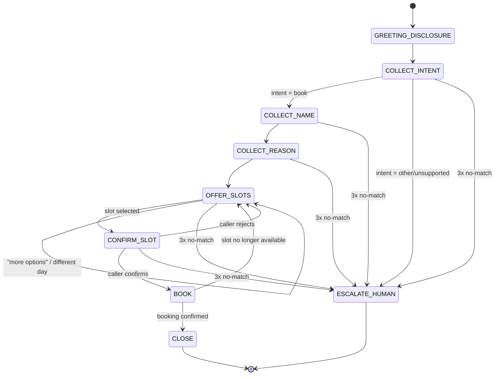

# Build Spec — Dialogue State Machine

This document defines the inbound appointment-scheduling conversation as an explicit finite
state machine: the states, what each collects and validates, how it transitions on success,
and how it handles no-match / invalid input. It is the contract that Phase 3 (dialogue
management) implements and Phase 6 (evals) tests against.

> **Scope note (Phase 0):** this is design only. No pipeline code implements it yet.
> Data examples are synthetic. No real PHI.

## Conventions

- **Global fallback policy:** every collecting state allows up to **2 reprompts** on
  `NO_MATCH` (unintelligible / off-topic / empty input). On the **3rd** failure the state
  routes to `ESCALATE_HUMAN`.
- **Global intents available in any state:** `repeat` (re-read the last prompt),
  `agent`/`human` (→ `ESCALATE_HUMAN`), `cancel`/`goodbye` (→ `CLOSE`).
- **Confirmation style:** slot selection and the final booking are explicitly read back and
  confirmed before any write to the scheduling API.
- **Tool boundary:** `OFFER_SLOTS`, `BOOK`, and hold management map to the three scheduling
  API endpoints (see the mapping table). This is where Phase 2 function-calling wires in.
- **LLM provider:** dialogue/function-calling runs on **Anthropic Claude Haiku 4.5** (swapped
  from Groq-hosted Llama during Phase 3 to unblock eval iteration past Groq's free-tier
  100K-tokens/day cap). Groq remains available as a **dormant** option for future latency
  benchmarking; switching back requires code changes in `agent/src/clinic_agent/pipeline.py`
  and `eval/run_eval.py` (there is no runtime provider flag). See CLAUDE.md for the full note.
  The state machine and tool contract below are provider-agnostic.
- **Telephony layer:** inbound calls arrive over **LiveKit SIP** (free tier, one number
  included: `+14842950169`), wired in Phase 5 (done). The agent still runs on the local
  transport by default (`MODE=local`); `MODE=telephony` switches to the LiveKit SIP path.
  The call-recording consent line (below) is delivered in the greeting on the telephony path.
  Setup is reproducible — see **Phase 5 — Telephony (LiveKit SIP) setup** below.

## State diagram



## States

### GREETING_DISCLOSURE
- **Purpose:** open the call, disclose that the caller is speaking with an AI, and (on
  telephony, Phase 7) state the call-recording consent line.
- **Says (example):** "Thanks for calling Grove Family Clinic. You're speaking with an
  automated AI assistant. I can help you book an appointment. How can I help today?"
- **Collects:** nothing (informational).
- **Validation:** none.
- **Transitions:** → `COLLECT_INTENT` (automatic after the greeting).
- **No-match:** n/a.

### COLLECT_INTENT
- **Purpose:** determine what the caller wants.
- **Collects:** `intent` ∈ {`book_appointment`, `other`}.
- **Validation:** classify caller utterance. Only `book_appointment` is supported this build.
- **Transitions:** `book_appointment` → `COLLECT_NAME`; `other`/unsupported (billing,
  prescriptions, clinical questions) → `ESCALATE_HUMAN`.
- **No-match:** reprompt ("I can help you book an appointment — would you like to schedule
  one?"). After 3 failures → `ESCALATE_HUMAN`.

### COLLECT_NAME
- **Purpose:** capture the patient's name for the booking.
- **Collects:** `patient_name` (string).
- **Validation:** non-empty; at least one alphabetic token. Optionally read back for
  spelling-sensitive names.
- **Transitions:** → `COLLECT_REASON`.
- **No-match:** reprompt ("Sorry, I didn't catch your name — could you say it again?").
  After 3 failures → `ESCALATE_HUMAN`.

### COLLECT_REASON
- **Purpose:** capture the reason for the visit (drives slot filtering / provider matching).
- **Collects:** `reason` (short free text, e.g. "annual checkup", "sore throat").
- **Validation:** non-empty. Map to a coarse visit category if possible; free text is
  acceptable. **Do not** solicit or store detailed clinical/PHI narrative.
- **Transitions:** → `OFFER_SLOTS`.
- **No-match:** reprompt once for clarity; a vague-but-present reason is accepted.
  After 3 failures → `ESCALATE_HUMAN`.

### OFFER_SLOTS
- **Purpose:** fetch and present available appointment slots.
- **Tool call:** `GET /availability` (optionally filtered by reason/provider/date).
- **Collects:** `selected_slot_id` — the caller's choice among the offered slots.
- **Says:** reads back 2–3 options at a time ("I have Tuesday at 9 AM with Dr. Rivera, or
  Wednesday at 2 PM with Dr. Chen — which works?").
- **Validation:** selection must match one of the offered slot IDs.
- **Transitions:** slot selected → `CONFIRM_SLOT`; "more"/"another day"/"different provider"
  → re-query and stay in `OFFER_SLOTS`; no availability at all → `ESCALATE_HUMAN`.
- **No-match:** reprompt with the options again. After 3 failures → `ESCALATE_HUMAN`.

### CONFIRM_SLOT
- **Purpose:** read the chosen slot back and get an explicit yes/no.
- **Tool call:** `POST /hold-slot` (places a short-lived hold on `selected_slot_id`, returns
  `hold_id`) — done on entry so the slot isn't lost while confirming.
- **Collects:** `confirmation` ∈ {yes, no}.
- **Says:** "That's Tuesday, March 4th at 9 AM with Dr. Rivera, for Jane Doe — shall I book
  it?"
- **Validation:** yes/no classification.
- **Transitions:** yes → `BOOK`; no → release hold, → `OFFER_SLOTS`.
- **No-match:** reprompt for a yes/no. After 3 failures → `ESCALATE_HUMAN` (release hold).

### BOOK
- **Purpose:** commit the booking.
- **Tool call:** `POST /confirm-booking` with `hold_id`, `patient_name`, `reason`.
- **Collects:** nothing (action state).
- **Validation:** API returns a `confirmation_id` on success.
- **Transitions:** success → `CLOSE`; hold expired / slot taken (409) → apologize, → `OFFER_SLOTS`;
  unexpected error → `ESCALATE_HUMAN`.
- **No-match:** n/a (no user input expected).

### CLOSE
- **Purpose:** confirm details and end the call politely.
- **Says:** "You're all set — Tuesday, March 4th at 9 AM with Dr. Rivera. Confirmation
  number 12345. Anything else? … Take care."
- **Collects:** nothing.
- **Transitions:** → end. (A follow-up "book another" request may loop back to
  `COLLECT_INTENT`.)

### ESCALATE_HUMAN (global terminal)
- **Purpose:** hand off when the request is unsupported or the caller is stuck.
- **Says:** "Let me get you to a member of our staff — one moment." (Phase 7: warm transfer.)
- **Transitions:** → end (transfer).

## Transition table

| State | Trigger | Next state |
|-------|---------|-----------|
| GREETING_DISCLOSURE | greeting delivered | COLLECT_INTENT |
| COLLECT_INTENT | intent = book_appointment | COLLECT_NAME |
| COLLECT_INTENT | intent = other / unsupported | ESCALATE_HUMAN |
| COLLECT_NAME | valid name | COLLECT_REASON |
| COLLECT_REASON | reason captured | OFFER_SLOTS |
| OFFER_SLOTS | slot selected | CONFIRM_SLOT |
| OFFER_SLOTS | "more" / different day/provider | OFFER_SLOTS (re-query) |
| OFFER_SLOTS | no availability | ESCALATE_HUMAN |
| CONFIRM_SLOT | caller confirms (yes) | BOOK |
| CONFIRM_SLOT | caller rejects (no) | OFFER_SLOTS (release hold) |
| BOOK | booking confirmed | CLOSE |
| BOOK | hold expired / slot taken | OFFER_SLOTS |
| BOOK | unexpected error | ESCALATE_HUMAN |
| *any collecting state* | 3rd consecutive no-match | ESCALATE_HUMAN |
| *any state* | "agent" / "human" | ESCALATE_HUMAN |
| *any state* | "cancel" / "goodbye" | CLOSE |

## State ↔ scheduling API mapping (Phase 2 wiring)

| State | Endpoint | Purpose |
|-------|----------|---------|
| OFFER_SLOTS | `GET /availability` | fetch open slots to offer |
| CONFIRM_SLOT | `POST /hold-slot` | hold the selected slot while confirming |
| CONFIRM_SLOT (reject) | (release hold) | let the hold TTL expire / free the slot |
| BOOK | `POST /confirm-booking` | commit the booking, get confirmation id |

## Data collected across the conversation

| Field | Source state | Notes |
|-------|--------------|-------|
| `intent` | COLLECT_INTENT | only `book_appointment` supported |
| `patient_name` | COLLECT_NAME | synthetic; not real PHI |
| `reason` | COLLECT_REASON | coarse visit reason; no clinical narrative |
| `selected_slot_id` | OFFER_SLOTS | from `GET /availability` |
| `hold_id` | CONFIRM_SLOT | from `POST /hold-slot` |
| `confirmation_id` | BOOK | from `POST /confirm-booking` |

## Governance touchpoints

- **AI disclosure** — mandatory, delivered in `GREETING_DISCLOSURE` on BOTH paths (local +
  telephony). Spoken deterministically (`prompts.AI_DISCLOSURE`), never LLM-generated.
- **Call-recording consent** — delivered in the greeting on the **telephony** path (Phase 5),
  before any booking begins (`prompts.TELEPHONY_GREETING` / `greeting_for("telephony")`). Not
  spoken on the local path, which records nothing.
- **PHI minimization** — `COLLECT_REASON` captures a coarse reason only; the agent never
  solicits detailed medical history. The Phase-2 system prompt also makes it explicit that the
  agent must never read a full name and a phone number back together in one utterance, and must
  not repeat phone numbers / DOB / IDs unless asked. All names/reasons in dev are synthetic.

## Phase-4 target list (known issues to fix during dialogue hardening)

Concrete defects observed in the Phase-3 eval (headless, 16 cases on Claude Haiku 4.5) and in a
manual live voice test. **All five are now fixed (Phase 4 complete) — see the Status column and
the resolution note below.** Each entry records the *exact observed behavior*, where the defect
lives, and how it was found. "Today" in the examples is Monday **2026-07-06** (the eval/live-test
date). Layer column: **LLM** = dialogue / prompt / state logic in the agent; **API** =
scheduling_api backend.

| # | Layer | Defect | Exact observed behavior | Found by | Status (Phase 4) |
|---|-------|--------|-------------------------|----------|------------------|
| 1 | LLM | **Relative-date grounding — wrong calendar date** (off-by-one on weekday references) | Live: caller asked for **"next Sunday"**; agent said **"July 13th"**, but July 13 is a **Monday** — the correct next Sunday is **July 12**. Eval `hp_sorethroat_specificday`: caller asked for **Tuesday** (Jul 7); agent called `check_availability(date='2026-07-08')`, booked Jul 8, and read it back as **"Tuesday, July 8th"** — but Jul 8 is a **Wednesday**. So the model computes the *wrong* calendar date for a relative weekday, and its spoken weekday label disagrees with the date it actually used. Not just mislabeling — the `date=` sent to the tool is wrong. | Live test + eval `hp_sorethroat_specificday` | ✅ **Fixed** — `build_phase2_system_prompt()` injects a 15-day `YYYY-MM-DD = Weekday` reference table so the model looks weekdays up instead of computing them; `hp_sorethroat_specificday` now books Tue Jul 7 with matching weekday label. |
| 2 | API | **Past-time slots offered** — `GET /availability` returns slots whose `start_time` is already in the past | Live: at **~4:25 PM EST (21:25 UTC)**, availability returned a **1:00 PM** slot for the current day — a time that had already passed. The endpoint filters only on `status='available'` (and optional date/reason/provider), never on `start_time >= now`. Fix direction (Phase 4): add a `start_time >= <current UTC>` filter to the availability query so only future slots are returned. This is a `scheduling_api/` change, distinct from the LLM-side defects. | Live test | ✅ **Fixed** — `get_availability` now filters `start_time >= _now()` (`scheduling_api/app/main.py`); regression test `test_availability_excludes_past_slots`. |
| 3 | LLM | **Mid-flow day change never converges to a booking** | Eval `ec_change_day_midflow`: caller booked, then switched day (tomorrow → the day after). Agent correctly re-queried both days (`check_availability(date='2026-07-07')` then `('2026-07-08')`) but then **never offered a concrete time and never called `hold_slot`/`confirm_booking`**; it looped on the clarifying question *"which of the three times would you prefer: 10:30 AM, 1:00 PM, or 2:30 PM on Wednesday, July 8th?"* Outcome: `gracefully_handled`, no booking, when a booking was expected. The caller's "that one's fine" / "yes, book it" had no concrete slot antecedent to bind to. | Eval `ec_change_day_midflow` | ✅ **Fixed** — prompt now offers ≤2 concrete times, binds a generic acceptance to the earliest offered slot, and enforces a single confirmation gate (hold → one read-back → yes → book), eliminating the loop and the extra pre-hold confirm. |
| 4 | LLM | **No empty-window fallback — escalates instead of offering the soonest slot** | Eval `ad_mumbled_vague`: mumbled caller said **"sometime next week"**; agent resolved that to Jul 13–17, queried all five days (all returned **0 slots**, outside the mock's 3-working-day seed window), and escalated (*"Take care!"*) — even though the caller then said **"whatever's open, earliest."** A hardened agent should, on an empty preferred window plus an "earliest is fine" signal, drop the window constraint and offer the soonest available slot before escalating. (Partly a test-design artifact: "next week" is genuinely outside the seed window — but the failure to fall back on "earliest" is a real dialogue gap.) | Eval `ad_mumbled_vague` | ✅ **Fixed** — on a zero-slot window the prompt now re-calls `check_availability` with no date filter for the soonest slot before escalating; `ad_mumbled_vague` now books. |
| 5 | LLM | **Past-time slot read-back** (defense-in-depth, linked to #1/#2) | Agent could read back a confirmed time already passed today. Backstopped by the #2 API filter; wanted a prompt-level guard too. | Live test | ✅ **Fixed** — prompt reads back full date + day-of-week + time and only offers/confirms future times (`{now_utc}` injected); backed by the #2 API filter. |

**Bonus bug found while fixing #3/#4 — fabricated booking:** on one eval run the agent read the
internal `hold_id` back as a "confirmation number" and said "you're all set" *without ever calling
`confirm_booking`* — a caller would believe in an appointment that never existed. Fixed with a
prompt invariant: no "you're all set" / confirmation number until `confirm_booking` returns one;
`hold_id` is never spoken.

**Eval result:** Phase-3 baseline **88% task completion / 81% overall pass** → Phase-4 **100% /
100%** (16/16), slot-filling 8/9 → 11/11. The two fragile edge cases (`ec_change_day_midflow`,
`ad_mumbled_vague`) were confirmed stable across 3 isolated runs each (temperature=0 is not fully
deterministic with tool use).

**Not defects (scored PASS, noted for clarity):** `ad_unsupported_intent` and `ad_wants_human`
correctly declined to book an out-of-scope / human-handoff request. Structural scoring can't
distinguish "escalated" from "declined-to-book" (both = no booking), so their display shows
`exp=escalated got=gracefully_handled` on a PASS; the traces confirm proper hand-off language.

## Phase 5 — Telephony (LiveKit SIP) setup

Inbound calls to `+14842950169` reach the same Pipecat pipeline as local dev; only the
transport changes. There is **one runtime switch** (`MODE`) and **one-time LiveKit
provisioning** (an idempotent script). Nothing about the ASR→LLM→TTS loop, tool calls, mic
gate, or barge-in differs between modes.

### How it fits together

```
caller phone ──PSTN──▶ LiveKit SIP (number +14842950169)
                          │  inbound trunk  (binds the number to our LiveKit project)
                          │  dispatch rule  (Direct → room "clinic-inbound")
                          ▼
                   LiveKit room "clinic-inbound" ◀── agent process (MODE=telephony)
                                                       joins the same room, waits for the
                                                       caller, then runs the booking flow
```

- **Direct dispatch** routes every inbound call into the single fixed room `clinic-inbound`
  (`config.TELEPHONY_ROOM_NAME`). The agent joins that same room and greets on
  `on_first_participant_joined` — i.e. when the caller actually connects, not at process
  start (the room exists but is empty before the call lands). Fine for a single demo call.
- **Concurrency (Phase 6):** Direct = one shared room, so it does **not** support simultaneous
  calls. Multi-call requires an **Individual** dispatch rule (room-per-call) + LiveKit agent
  dispatch starting one agent process per room — the "one container per session" model Phase 6
  Dockerizes. The setup script documents this in a comment.

### Required `.env` (agent/.env, git-ignored)

```
LIVEKIT_URL=wss://<your-project>.livekit.cloud
LIVEKIT_API_KEY=<key>
LIVEKIT_API_SECRET=<secret>
LIVEKIT_PHONE_NUMBER=+14842950169
```

### Steps (reproducible)

1. **Provision the SIP trunk + dispatch rule (one-time, idempotent):**
   ```bash
   cd agent && uv run python scripts/setup_livekit_sip.py
   ```
   The script prints `FOUND` vs `CREATED` per resource, so a re-run shows current state
   without changing anything. It never deletes or mutates existing resources.

2. **Start the agent in telephony mode** (in a separate terminal; the mock scheduling API must
   also be running per the root README):
   ```bash
   cd agent && MODE=telephony uv run python -m clinic_agent.pipeline
   ```
   It joins room `clinic-inbound` and logs that it is waiting for the inbound SIP caller.

3. **Call `+14842950169`.** The agent greets with the AI disclosure + call-recording consent,
   then runs the normal booking flow.

Local dev is unchanged: omit `MODE` (defaults to `local`) to use the laptop mic/speaker.

### Known limitations / Phase 6 follow-ups

- **Seed slot hours are stored as UTC**, not clinic-local. `scheduling_api/app/seed_data.py`
  generates slots at `09:00, 10:30, 13:00, 14:30` **UTC** (`tzinfo=timezone.utc`). The Phase-5
  timezone fix made the agent's *current-time* reasoning clinic-local (`America/New_York`), but
  the stored slot **hours** are still UTC while the availability filter compares on the UTC
  instant. At early-morning hours this is invisible (every slot is future in both frames), but a
  **mid-day caller may see a slot filtered out that still appears upcoming in Eastern time**
  (e.g. a 09:00 UTC slot = 5 AM EDT is dropped once 09:00 UTC passes, even though the agent
  speaks it as an early-morning local time). **Fix:** localize the seed to `America/New_York`
  when storing (`datetime.combine(day, t, tzinfo=CLINIC_TZ)`) so slot hours are true clinic-local
  times. **Deferred to Phase 6.**
- **1–2 seconds of audio noise at the very start of a telephony call is normal** SIP/RTP
  media negotiation (codec/jitter-buffer settling), **not a code issue** — no fix needed.
- **Reschedules are handled as brand-new bookings** — the mock API has no patient-lookup
  endpoint, so a returning caller re-collects intake and books a fresh slot rather than amending
  an existing appointment. **Deferred:** add a patient/appointment lookup endpoint if reschedule
  flows are needed.

## Phase 6 — Observability, Docker, and the ngrok demo

Phase 6 makes the running agent measurable and packageable: structured per-turn latency logging,
a live dashboard, container images, and a one-command demo launcher. No cloud deployment — the
demo runs the agent locally (it reaches LiveKit Cloud outbound) and uses **ngrok** only to expose
the dashboard/API publicly.

### Observability — per-turn latency + call outcomes

The agent writes newline-delimited JSON to **`logs/calls.jsonl`** (one object per event), *alongside*
the existing human-readable console logs (`ASR ▶ / LLM ▶ / TOOL ▶ / TTS ▶`) — the JSON is an added
sink, not a replacement. Instrumentation lives in `agent/src/clinic_agent/metrics.py`
(`LatencyCollector` + three `MetricsTap` pass-through processors inserted after STT, LLM, and TTS);
the taps never mutate or drop a frame.

A **turn** spans the caller's VAD silence to the first audio frame of the bot's reply. Four
latencies are captured per turn from the Pipecat frame stream:

| Metric | Boundary (frame → frame) |
|--------|--------------------------|
| `asr_ms` | `VADUserStoppedSpeakingFrame` → final `TranscriptionFrame` |
| `llm_ms` | final `TranscriptionFrame` → first `LLMTextFrame` **or** first `FunctionCallInProgressFrame` |
| `tts_ms` | last `LLMFullResponseEndFrame` → first `OutputAudioRawFrame` |
| `e2e_ms` | `VADUserStoppedSpeakingFrame` → first `OutputAudioRawFrame` (voice-to-voice) |

> The VAD-silence boundary is Pipecat's `VADUserStoppedSpeakingFrame` (emitted by the in-pipeline
> `VADProcessor`), *not* the higher-level `UserStoppedSpeakingFrame` — a distinction that matters:
> using the wrong class silently records zero turns.

Deltas use `time.monotonic()`. Each turn record also carries **ASR confidence** (Deepgram's
`result.channel.alternatives[0].confidence`, or `null` if not surfaced — a one-time session warning
fires if it's never present) and `had_tool_call`. Each scheduling-tool call emits a `tool` event
(`endpoint`, `http_status`, `latency_ms`, `success`). At hangup a `call_summary` event records the
**outcome** and **P50/P95/P99** for all four stages, and the agent also prints a human-readable
console line, e.g.:

```
[session] outcome=booked turns=6 | ASR p50=210ms p95=340ms | LLM p50=480ms p95=720ms | TTS p50=320ms p95=450ms | E2E p50=1010ms p95=1340ms
```

Two honesty caveats (surfaced in the dashboard footnotes too):

- **Outcome is heuristic-based:** `booked` = a `confirm_booking` succeeded; `escalated` = availability
  came back empty and the agent handed off; `abandoned` = the call ended with neither. It approximates
  intent; it doesn't read it.
- **`llm_ms` on tool-call turns ends at the *first tool call*,** not the final spoken response, so those
  turns show a lower LLM figure than the caller feels. **`e2e_ms` is the honest number on tool-call turns.**

`logs/calls.jsonl` is a runtime artifact (git-ignored), and `logs/` is shared between the agent
(writer) and the API (reader) via the repo-root `logs/` dir — overridable with `CLINIC_LOG_DIR`
(set to a shared volume under Docker).

### Dashboard — `GET /metrics` + `/dashboard`

The scheduling API gained two routes (`scheduling_api/app/metrics.py` + `main.py`):

- **`GET /metrics`** reads `logs/calls.jsonl` and returns aggregated stats — P50/P95/P99 per stage,
  ASR confidence avg/min/max, tool-call success + per-endpoint P50, outcome counts, and the last 5
  calls. A missing/empty log yields a valid zeroed payload (never a 500).
- **`GET /dashboard/`** serves `dashboard/index.html` (plain HTML + vanilla JS, no framework),
  mounted same-origin so it just fetches `/metrics` (no CORS). It auto-refreshes every 5 s, so a call
  in progress shows up live. Screenshot-friendly for the README.

### Docker (`docker compose up`)

Both services are containerized: `scheduling_api/Dockerfile`, `agent/Dockerfile` (defaults to
`MODE=telephony`; the agent installs PortAudio because Pipecat's `[local]` extra imports PyAudio at
module load even in telephony mode), and a root **`docker-compose.yml`**. One command starts the whole
stack:

```bash
docker compose up --build
```

The API is published on `:8000`; the agent reaches it by the compose **service name**
(`SCHEDULING_API_BASE_URL=http://scheduling_api:8000`), never localhost. Secrets come only from the
git-ignored `agent/.env` (loaded via `env_file`) — nothing secret is baked into an image (see each
`.dockerignore`, which excludes `.env`). `logs/` is a shared bind mount so the agent writes
`calls.jsonl` and the API reads it. (For **concurrent** calls, switch the LiveKit dispatch rule from
Direct to Individual and run one agent container per room — see the "one container per session" note
in CLAUDE.md; the single-room demo does not need this.)

> **Known limitation — Docker not locally tested.** The Docker files are present and validated
> (compose config parses; Dockerfiles follow the standard uv build) but **not locally tested
> (Docker not installed on the dev machine due to storage constraints).** Containerized deployment
> is documented for production use; the live demo runs on the host via `start_demo.sh`, which *is*
> fully tested.

### Demo startup sequence

For a live demo, run the agent on the host (`start_demo.sh`) rather than in Docker — it reaches
LiveKit Cloud outbound and needs no inbound tunnel. **`./start_demo.sh`** does steps 1–3 in one
command and prints the dashboard URL (and the public ngrok URL if ngrok is already running):

1. **Start the scheduling API** (`:8000`, with `/metrics` + `/dashboard`).
2. **Start the agent** in `MODE=telephony` (joins LiveKit room `clinic-inbound`, waits for the call).
3. **Optional — expose the dashboard publicly:** `ngrok http 8000` in another terminal. ngrok is only
   for public dashboard/API access; the agent itself needs no tunnel.
4. **Call `+14842950169`.** The per-call session summary (P50/P95/P99) is written to `logs/calls.jsonl`
   and printed to the console the moment the caller hangs up; the dashboard reflects it within 5 s.

```bash
./start_demo.sh        # API + agent (MODE=telephony); Ctrl-C stops both
# optional, separate terminal:
ngrok http 8000        # public dashboard at https://<sub>.ngrok-free.app/dashboard/
# then call +14842950169
```

## Deployment (Railway) — always-on cloud hosting

The local `start_demo.sh` + ngrok path (above) needs the author's laptop running. For a
recruiter-facing demo the two services are also deployed to **Railway** so `+14842950169` is
answered 24/7 with nothing running locally.

### Why this works on a PaaS with no inbound telephony support

The agent is an **outbound-only worker**: at startup it mints a LiveKit join token and connects
*out* to LiveKit Cloud (room `clinic-inbound`), then waits. **LiveKit Cloud** terminates the
PSTN/SIP call and bridges media — Railway never needs an inbound port, a public domain, or
SIP/UDP ingress for the agent. So the SIP trunk + dispatch rule (which point at a *room*, not a
server) are unchanged from Phase 5 regardless of where the agent runs.

### Topology

```
  PSTN call → +14842950169 → LiveKit Cloud (SIP trunk → room clinic-inbound)
                                     ▲  outbound WS
                                     │
   Railway: agent (MODE=telephony) ──┘   ── HTTPS ──▶  Railway: scheduling-api (public URL)
     restartPolicyType=always, 1 replica          GET /availability · POST /hold-slot · /confirm-booking
```

- **`scheduling-api`** — public Railway URL (`https://scheduling-api-production-4a80.up.railway.app`).
  The agent reaches it over HTTPS via `SCHEDULING_API_BASE_URL`. Chosen over Railway private
  networking to avoid the IPv6-only internal-DNS gotcha (uvicorn `--host 0.0.0.0` binds IPv4).
- **`agent`** — no public port. `restartPolicyType="always"` (it must be joined to the room when
  a call lands) and `numReplicas=1` (one audio pipeline per process — see the concurrency note in
  CLAUDE.md).
- Both build from the **existing Phase-6 Dockerfiles** (`builder="dockerfile"` in each service's
  `railway.toml`); nixpacks can't cleanly handle the agent's PortAudio/`build-essential` deps.

### Config files added

- `agent/railway.toml`, `scheduling_api/railway.toml` — pin the Dockerfile builder + restart/replica
  policy. Everything else (secrets, `SCHEDULING_API_BASE_URL`, `MODE`) comes from Railway env vars.

### No SQLite volume — rolling slot refresh instead

The DB is **intentionally ephemeral** (re-seeded on boot). A persistent volume would be *harmful*:
seeded slots carry fixed ids but dates relative to seed time, and seeding is `INSERT OR IGNORE`,
so a persisted DB would freeze slot dates and `/availability` would go empty within ~3 days.
Instead, `db.refresh_available_slots()` re-stamps still-`available` slots to the upcoming
next-few-working-days window on every `/availability` read (and at startup), leaving `held`/`booked`
slots untouched. An always-on server therefore never runs out of upcoming slots — verified in the
cloud: `/availability` returns future-dated slots indefinitely with no restart.

### Redeploy steps (reproducible)

Prereqs: `railway` CLI, logged in (`railway login`); secrets in `agent/.env`.

```bash
# One-time: create the project + two empty services (already done for clinic-voice-agent)
railway init --name clinic-voice-agent --workspace <workspace-id>
railway add --service scheduling-api
railway add --service agent

# scheduling-api: deploy its dir as build root, then expose it publicly
railway up ./scheduling_api --path-as-root --service scheduling-api --detach
railway domain --service scheduling-api --port 8000     # → https://<api>.up.railway.app

# agent: set env (secrets piped from .env via stdin so values never hit the shell history),
# point it at the deployed API, and deploy
for k in DEEPGRAM_API_KEY ANTHROPIC_API_KEY ANTHROPIC_MODEL CARTESIA_API_KEY CARTESIA_VOICE_ID \
         LIVEKIT_URL LIVEKIT_API_KEY LIVEKIT_API_SECRET LIVEKIT_PHONE_NUMBER; do
  grep -E "^${k}=" agent/.env | cut -d= -f2- \
    | railway variable set "$k" --stdin --service agent --skip-deploys
done
printf telephony | railway variable set MODE --stdin --service agent --skip-deploys
printf 'https://<api>.up.railway.app' \
  | railway variable set SCHEDULING_API_BASE_URL --stdin --service agent --skip-deploys
railway up ./agent --path-as-root --service agent --detach

# Confirm LiveKit routing is still correct (idempotent), then place a test call
cd agent && uv run python scripts/setup_livekit_sip.py
railway logs --service agent --lines 200      # watch the call trace
```

### Verified end to end (from the cloud)

A live inbound call to `+14842950169` — with the agent running **only on Railway** — connected,
ran the full booking flow against the deployed `scheduling-api`, and returned a confirmation
number. From the agent's Railway logs:

```
[tools] registered scheduling functions → https://scheduling-api-production-4a80.up.railway.app
[telephony] caller joined room (participant=…)
TOOL ▶ GET /availability → 3 slots …
TOOL ▶ POST /hold-slot → held slot 10 hold_id=…
TOOL ▶ POST /confirm-booking → BOOKED confirmation_id=7E45AA57 Thursday, July 9 at 10:30 AM …
[session] outcome=booked turns=7 | ASR p50=187ms p95=211ms | LLM p50=895ms p95=1279ms
          | TTS p50=64ms p95=840ms | E2E p50=1314ms p95=2297ms
```

### Known limitations on Railway

- **Free-tier cost.** Two always-on containers (the agent's event loop can't scale to zero — Direct
  dispatch needs it joined to the room 24/7) run ~$4–6/month combined; the agent is the cost driver.
  This fits the Railway Hobby plan ($5/mo, $5 usage included) but with little headroom — watch usage.
- **`/dashboard` is not served on Railway.** The dashboard static files live at the repo root,
  outside the `scheduling_api/` build context, and the Dockerfile doesn't COPY them (docker-compose
  bind-mounts them locally). `GET /metrics` still responds (zeroed, since the agent writes
  `calls.jsonl` to its own container, not a shared volume). Per-call latency remains in the agent's
  Railway logs (the `[session]` summary line). Wiring the public dashboard would mean either copying
  the static files into the API image or having the agent POST its per-call summary to the API — a
  deliberate follow-up, out of scope for the "verify a live cloud call" goal.

---

## Phase 10 — In-house event loop (`agent/src/clinic_agent/core/`)

Pipecat's `Pipeline` / `FrameProcessor` chain is replaced by an orchestration loop this project
owns. Media transport (LiveKit SIP, the local audio device) and the vendor models are still
bought — writing a SIP/WebRTC stack is where the rebuild would die, and it is not what the loop
rewrite is about.

`clinic_agent.pipeline` (Pipecat) is **unchanged and still runnable**. The new engine is a
separate entrypoint, so a problem in it costs a one-word command change rather than the live
phone number.

```
python -m clinic_agent.core     # in-house loop  (MODE=local | telephony)
python -m clinic_agent.pipeline # Pipecat path   (unchanged fallback)
```

### The shape

```
adapters ──emit──▶ asyncio.Queue ──▶ reduce(state, event) ──▶ [actions] ──▶ adapters
                                          (pure)
```

| Module | Role |
|---|---|
| `events.py` | Typed, JSON-round-trippable events — the only things the reducer sees |
| `actions.py` | What the reducer asks adapters to do |
| `state.py` | Immutable `CallState` + the turn-phase FSM |
| `reducer.py` | Pure `reduce(state, event) -> (state, actions)` — **the engine** |
| `session.py` | `CallSession`: one queue, one drain loop, all per-call state |
| `recorder.py` | Trace recording + deterministic replay |
| `telemetry.py` | Phase-6 latency metrics, re-sourced from events |
| `adapters/` | `media`, `turn`, `stt`, `llm`, `tts`, `tools` |

**Raw audio is never an event.** 20 ms PCM frames go `media → TurnEngine`; only derived
decisions (`SpeechStarted`, `SpeechStopped`, `UserInterrupted`) reach the reducer. That is what
keeps a call trace small enough to commit and exact enough to replay.

**The FSM** (`Phase`: `INIT → GREETING → LISTENING → THINKING → TOOL_WAIT → SPEAKING → CLOSED`)
is about the *turn*, not the booking script. The prompt still guides what to say; the FSM decides
what the engine does — and unlike prose, it is enforceable and testable.

### What the purity buys

1. **Deterministic replay.** A recorded call replays through `reduce()` in milliseconds with no
   audio, no network, and no API keys. This is the phase's exit criterion and becomes the Tier-1
   eval in Phase 16.
2. **Speculative execution (Phase 14).** Because the loop owns turn boundaries, it can start an
   LLM request on a partial transcript and cancel on continue. Not expressible inside a linear
   frame chain.
3. **Granular failover (Phase 15).** Provider degradation is just another event, so the
   degradation ladder becomes testable logic rather than scattered `try/except`.

Every identifier (`req-N`, `utt-N`) is derived from a counter in the state rather than `uuid4()`,
and the reducer never reads a clock — all timing arrives on the event. Without both, every replay
comparison would fail for reasons unrelated to the logic under test.

### Ported forward, not rewritten

- **`MicGateLogic`** is unchanged and becomes `TurnEngine` input. `frame_rms` was vectorized with
  numpy (`frame_rms_pure` retained as the reference, pinned by a parity test): it runs on every
  20 ms frame, 50×/second per session, directly on the loop that must also deliver audio on time.
- **`scheduling_tools.py`** schemas carry over untouched. The HTTP + logging + metrics body was
  extracted into `execute_tool()`, now shared verbatim by the Pipecat handlers and the core
  `ToolExecutor` — one implementation, so the two engines cannot drift.
- **`metrics.py`**'s `LatencyCollector` is unchanged; only its input moved from three frame taps
  to one event subscriber. The Phase-6 failure mode where watching the wrong frame class silently
  recorded `turns=0` is now structurally impossible: there is one `SpeechStopped` event and it
  means one thing.

### Defects found and fixed during the build

Both surfaced on the first end-to-end run, and neither is visible in unit tests:

- **Sentence splitter broke on abbreviations.** `"...with Dr. Aisha Patel?"` was split into
  `"...with Dr."` and `"Aisha Patel?"`. Every provider in the clinic is a "Dr.", so this fired on
  essentially every booking. `_is_sentence_end()` now rejects a period after a known abbreviation
  or a single-letter initial.
- **`CallerPresent` could be reduced before `CallStarted`.** Both transports can announce a caller
  the instant they start — the local mic is live as soon as its stream opens, and a SIP call can
  be bridged into the room before the agent finishes connecting. The greeting would then be chosen
  against the default mode and a **telephony caller would never hear the call-recording consent
  line**. `CallStarted` is now enqueued before any adapter starts.

### Vendor boundaries (raw, no Pipecat wrapper)

| Layer | Implementation | Detail worth knowing |
|---|---|---|
| STT | Deepgram websocket | Segments accumulate on `is_final` and release on `speech_final`; `UtteranceEnd` is the backstop. Emitting per `is_final` would restart the LLM three times per sentence. |
| LLM | `anthropic` SDK streaming | Text deltas stream live (feeds sentence-by-sentence TTS); tool calls emit after the stream so the SDK assembles the JSON. Cancellation emits **no** `LLMFailed`. |
| TTS | Cartesia websocket | One `context_id` per utterance, sentences appended with `continue: true`, closed by a `final` flush — continuous prosody instead of butted-together fragments. |
| Media | PyAudio / `livekit.rtc` | Owns playback, and therefore owns `BotStartedSpeaking` / `BotStoppedSpeaking`. Cartesia's `done` means *synthesis* finished; using it as end-of-turn would reopen the mic mid-sentence. |
| VAD | `SileroVADAnalyzer` (kept from Pipecat) | A plain ONNX wrapper with an `analyze_audio()` coroutine, not a pipeline component. Re-implementing it buys nothing. |

Prompt caching is wired but **off by default** (`CLINIC_PROMPT_CACHE=1`): Phase 8 measured the
cacheable prefix at 3,811 tokens against Haiku 4.5's 4,096 minimum, where Anthropic accepts the
breakpoint and silently caches nothing. Enable it together with a model whose minimum the prompt
clears, and verify with a non-zero `usage.cache_read_input_tokens`.

### Verification

`agent/tests/` — 70 passing.

- `test_reducer.py` (30) — the FSM: greeting determinism, streaming TTS chunking, the tool
  round-trip, parallel-result ordering, stale-request rejection, and the nastiest state in the
  loop: **an interruption mid-tool must synthesize cancellation `tool_result` blocks**, because
  Anthropic rejects a conversation containing a `tool_use` with no matching result.
- `test_replay.py` (9) — record → disk → `reduce()` reproduces identical state *and* identical
  action sequence; replays are stable across runs; traces survive a newly added event field.
- `test_session.py` (5) — the real `CallSession` loop with vendor adapters faked: full booking,
  barge-in cancelling both LLM and TTS, the `CallStarted` ordering guarantee, and **two sessions
  in one process sharing no state** (the defect this phase exists to fix).

**Text-in-the-loop run** (real Claude, real scheduling API against local Postgres; only
media/STT/TTS faked) — a 10-turn booking completed end to end:

```
outcome=booked turns=10 events=131
tools invoked : check_availability, check_availability, hold_slot, confirm_booking
greeting      : AI disclosure + call-recording consent (MODE=telephony)
LLM p50=648ms p95=1469ms   E2E p50=912ms p95=2689ms   (ASR/TTS faked, so ~0)
replay of the recorded trace matches the live final state exactly
```

The two `check_availability` calls are the Phase-4 empty-window fallback working: the first
filtered lookup came back empty, and the agent re-checked without a date filter rather than
escalating.

**Not yet verified:** a live phone call through the new engine. The LLM adapter was checked
against the real Anthropic API (TTFT 780 ms, correct date resolution, correct tool schema), and
the tool executor against the real scheduling API on both paths — but the media/STT/TTS adapters
have not carried real audio. That is the remaining step before the new engine replaces the
Pipecat path as the default.

---

## Phase 11 — Concurrency + load proof

Phase 10 made many sessions per process *possible* by moving all per-call state into
`CallSession`. Phase 11 makes it *true*, and measures it.

The starting position was one call per process, justified in `CLAUDE.md` by the GIL: CPU-bound
audio work on one call would stall the others. **The mechanism was real and the conclusion was
wrong.** The fix is not a process per caller — it is making per-session work non-blocking.

### The audit (measured, not guessed)

| Cost | Before | After | How |
|---|---|---|---|
| Silero VAD per session | **7.97 MB, 23.4 ms** | **0.002 MB, 0.46 ms** | Share the ONNX session process-wide; only the ~1 KB recurrent state is per-stream (`core/vad.py`) |
| VAD threads | 1 `ThreadPoolExecutor` **per session** | one bounded pool, sized to cores | Inference is CPU-bound; the useful ceiling is core count, not session count |
| JSONL record write | **22.4 µs** (`open`/`write`/`close`) | **2.1 µs** shared handle, **0.9 µs** buffered | `core/jsonl.py` — metrics shares one descriptor per process; traces buffer 64 lines |

At 1,000 sessions the VAD change alone is the difference between ~8 GB of byte-identical model
weights and ~2 MB. The shared analyzer was verified to produce **bit-identical confidences over
40 sequential frames**, recurrent state included — sharing weights must not share state, and a
reused analyzer is explicitly `reset()` on assignment so caller #2 does not start inside caller
#1's audio.

### Components

| Piece | What it does |
|---|---|
| `core/worker.py` | Hosts N `CallSession`s. Capacity limits, a **prewarmed** analyzer pool (cold start belongs at boot, not in the caller's first impression), graceful `drain()` that sheds new calls while letting in-flight ones finish, and per-outcome stats. |
| `core/router_client.py` | Worker side of the control plane: register, heartbeat, poll assignments. **A router outage never ends live calls** — losing the coordinator must not become a data-plane outage. |
| `session_router/registry.py` | Placement policy. No I/O, no clock of its own — every method takes `now`, so worker death and heartbeat expiry are deterministic in tests instead of `sleep`-driven. |
| `session_router/app.py` | LiveKit `room_started`/`room_finished` webhooks, worker register/heartbeat/drain, `/status`. |
| `loadtest/` | Tier-A harness: seeded synthetic providers + the real loop, plus a dependency-free SVG chart. |

### Tier-A results (measured)

Vendors are replaced by **fixed** seeded latency distributions drawn from this project's own
measurements, so any growth in voice-to-voice latency as concurrency rises is the orchestrator.
Both sweeps run the production path: real queue, real `reduce()`, real action dispatch, real
metrics. 10-core M-series laptop, one process.

**Loop mode** (no audio — bounds the event loop, reducer, and queue):

| concurrency | e2e p50 | e2e p95 | loop lag p95 | CPU/session | peak RSS |
|---|---|---|---|---|---|
| 1 | 1532 ms | 2982 ms | 0.7 ms | 0.388 s | 193 MB |
| 10 | 1345 | 3174 | 0.7 | 0.117 | 193 |
| 100 | 1345 | 2773 | 0.8 | 0.072 | 193 |
| 500 | 1395 | 3004 | 0.7 | 0.024 | 193 |
| **1000** | **1394** | **2871** | **0.7** | **0.018** | **193** |

6,000 turns across 1,000 concurrent sessions, **zero timeouts**, in 47.8 s wall.

**Audio mode** (synthetic PCM through the real `TurnEngine` at real-time pace — real
`frame_rms`, real Silero, 50 frames/s/session):

| concurrency | e2e p50 | e2e p95 | loop lag p95 | CPU/session | peak RSS |
|---|---|---|---|---|---|
| 5 | 1370 ms | 2645 ms | 0.8 ms | 0.312 s | 197 MB |
| 100 | 1343 | 2752 | 0.9 | 0.102 | 197 |
| 400 | 1387 | 2906 | 1.4 | 0.052 | 197 |
| 800 | 1403 | 2865 | 3.4 | 0.048 | 206 |
| 1600 | 1479 | 3021 | **15.2** | 0.056 | 234 |

Charts: `loadtest/results/tierA-loop.svg`, `loadtest/results/tierA-audio.svg`.

### What the knee actually is — stated precisely

**The latency knee was not reached.** Voice-to-voice p50 and p95 are flat from 1 to 1,000
sessions (loop) and 5 to 1,600 (audio, with real VAD on every 20 ms frame). Claiming a knee we
did not observe would be inventing a number.

What *does* move is **event-loop lag**, and it moves superlinearly past ~400: 1.4 ms → 3.4 ms →
15.2 ms across two doublings. That is the worker reporting that its scheduling headroom is
eroding while callers still cannot hear any difference — 15 ms of scheduling delay is invisible
next to a 1.4 s turn. So the honest finding is:

> On this hardware, a single worker process carries **at least 1,600 concurrent sessions**
> without measurable latency degradation. Scheduling headroom begins eroding around **800**,
> which is where a capacity limit should be set — with the ceiling above, not at, that number.

Three caveats that keep this from being oversold:

1. **Synthetic providers do not backpressure.** Real Deepgram and Cartesia mean 2N websockets,
   TLS, and inbound frame decoding, none of which is in this measurement.
2. **`--mode audio` feeds silence.** Silero's cost is fixed per frame so the CPU is
   representative, but the STT/TTS network path is not exercised.
3. **One machine, one process.** This measures a worker's ceiling, not a fleet's.

A methodological bug is worth recording because the first run reported a knee that did not
exist: at concurrency 1 with 6 turns there are **six** e2e samples, so its "p95" is the
sixth-largest of six — it misses the tool-call turns entirely and reads low, making every higher
level look like a regression. Low-concurrency levels are now repeated until they carry
comparable sample counts (`--min-samples`, default 60), and under-sampled levels are flagged in
the output.

### SIP dispatch — opt-in, and why

`scripts/setup_livekit_sip.py --dispatch individual` creates the room-per-call rule that real
concurrency needs. It is **not the default**, deliberately: switching it changes how a live
phone number behaves, and an agent sitting in the old shared room will never see another call —
so flipping it before the router and workers are running takes `+14842950169` off the air. The
script also never deletes the rule of the other kind; it reports the conflict and leaves the
removal as a deliberate step. `agent/railway.toml` documents why `numReplicas` stays at 1: the
*engine* constraint is gone, the *dispatch* constraint is not.

### Verification

- `agent/tests/` — **88 passing** (18 new in `test_worker.py`: shared-VAD identity and state
  isolation, capacity limits and rejection, prewarm hit/miss, drain vs. timeout, one failing
  session not taking the worker down, and concurrent sessions sharing no conversation state).
- `session_router/tests/` — **26 passing** (15 registry + 11 HTTP), all clock-injected: least-
  loaded placement, duplicate-webhook suppression, full-fleet vs empty-fleet rejection reported
  distinctly, heartbeat expiry, orphan re-dispatch, and clean drain.

### Not done — Tier B

**Tier B (25–50 concurrent real calls) has not been run.** It needs real PSTN capacity and real
provider spend against live keys, and it is the only thing that produces a true cost-per-minute
and validates the vendor path under concurrency. Everything it needs is built; the number is not
claimed. Also outstanding from Phase 10: **no live phone call has been placed through the
in-house engine at all**, which is the gate before any of this reaches the demo number.

The router's LiveKit webhook is **not authenticated** — LiveKit signs webhooks with an
Authorization JWT and this build does not verify it. Acceptable for a load-test control plane on
a private network; a prerequisite for deploying it anywhere public, where an unauthenticated
caller could spawn agent sessions at will.
